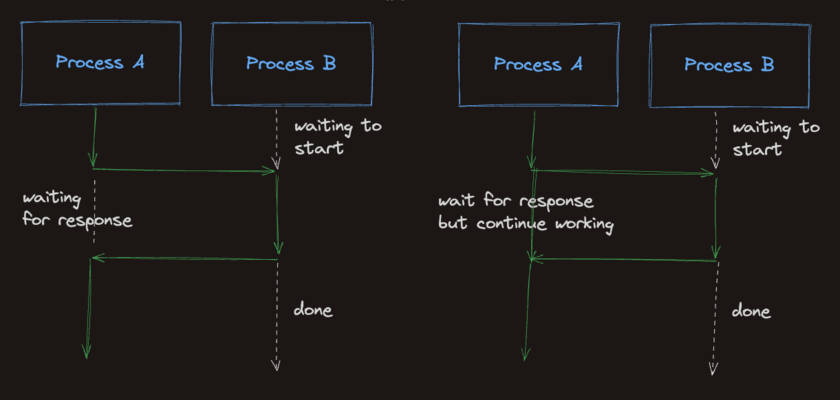
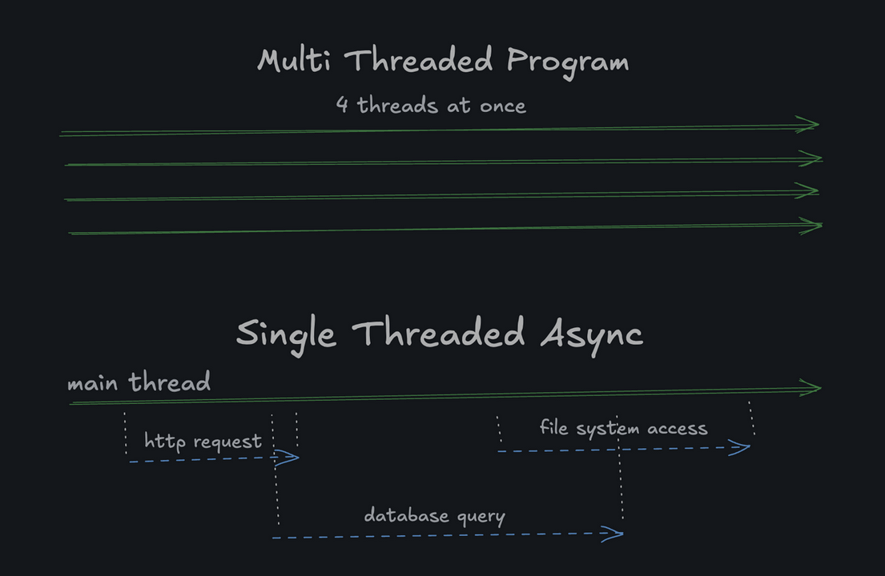

# Python - Programming Fundamentals

## Functions

### None (NoneType)

* **None** is the Type `NoneType`
    * **Essentially**, No value / not set / doesn’t exist (but different than 0 since 0 can be technically an
      integer)...
    * Useful in error handling, failing gracefully, optional function arguments, variables that will be filled later,
      items that are there, and items that potentially aren't there, etc.
    * Used in situations where a user hasn't selected any option (e.g., limbo)

* In the case of print debugging, use `type`:

```python
print(type(var_1))
```

### Multi-Variable Declaration

> A way to save space and keep the code clean by specifying setting all of the variables on the same line, BUT they must
> all be related to one another for sanity's sake!

```python
# This example...
sword_name, sword_damage, sword_length = "Excalibur", 10, 200

# Same as above...
sword_name = "Excalibur"
sword_damage = 10
sword_length = 200
```

### `return`

`return`: Makes the value available to the caller of the function

> [!NOTE]
>
> `return` keeps the result just in case you want to use the result somewhere else within your program. Another way to
> think about it is that the `return` function is like an **output port** rather than a storage area.
>
> It's used inside a function to send a value back to the place where the function was called. Once the return is
> executed, the function stops running, and any code written after it is ignored.

* A **function call** is like asking a helper: “Here are some inputs, please compute something and hand me back the
  result (via `return`)."
* `return` is the moment the helper hands you the result and stops working.

```python
def square(n):
    return n * n

result = square(4)
print(result)

# Output = 16
```

### `f-strings` (Formatted Strings)

> Basically, a really flexible way to create strings and complex statements that require the use of previously defined
> variables that change over time.

For example:

```python
def f_string(your_name):
  name = f"{your_name} for the f-string example"
  return name

# Usage
print(f_string("John"))
print(f_string("Jane"))

# Output
# John for the f-string example
# Jane for the f-string example
```

* Here we can use f-strings to take the changing variable of `your_name` and append additional text to the desired name.
* Obviously, f-strings are far more powerful than the example provided, but this gives you the gist...

### Parameters vs. Arguments

**Parameters**

* Are the placeholders, names, or symbols that are used inside the function. They can be whatever you want them to be (
  `a`, `b`, `var`)
* **P**arameter = **P**laceholder

**Arguments**

* Are the actual values that go into the function (`5`, `6`, `"some value"`)
* **A**rguments = **A**ctual Value

```python
# a and b are parameters
def add(a, b):
    return a + b

# 5 and 6 are arguments
sum = add(5, 6)
```

### Default Values

> Allows you to specify the default output for the function parameter if the arguments are optional. Prevents the
> function or program from breaking.

```python
def get_greeting(email, name="there"):
    print("Hello", name, "welcome! You've registered your email:", email)

get_greeting("user1@example.com", "User1")
# Hello User1 welcome! You've registered your email: user1@example.com

get_greeting("user1@example.com")
# Hello there welcome! You've registered your email: user1@example.com
```

## Debugging Basics

* Let's say you're looking at a lone function within a massive code base:

```python
def some_function(foo, bar):
```

* A good way to quickly determine what the function is supposed to do is to include a **`return None, None`** (basically
  like a "Debug Allow All" or Sanity Check to display the arguments that are required...)

```python
def some_function(foo, bar):
  return None, None
```

## Computing Basics

### Floor Division

> Like normal division except the result is **[floored](https://en.wikipedia.org/wiki/Floor_and_ceiling_functions)**,
> meaning the result is rounded down to the nearest integer using the **`//`** operator.

```python
7 // 3
# 2 (an integer, rounded down from 2.333)
-7 // 3
# -3 (an integer, rounded down from -2.333)
```

### Floor Division and Integer Output Puzzle

```python
'''
Here we are ensuring that we're doing pure integer math rather than introducing floats (we want 10 instead of 10.0).
Initially, "int((current_mah / capacity_mah) * 100)" was used, but this would introduce bugs later on with situations with more complex numbers.
'''
def battery_percent_remaining(current_mah, capacity_mah):
    int_percent = current_mah * 100 // capacity_mah
    return int_percent


def minutes_remaining(current_mah, drain_ma):
    total_minutes = current_mah * 60 // drain_ma
    return total_minutes


def format_battery_status(current_mah, capacity_mah, drain_ma):
    format_percent = battery_percent_remaining(current_mah, capacity_mah)
    format_min_remaining = minutes_remaining(current_mah, drain_ma)

    hour = format_min_remaining // 60
    minutes = format_min_remaining % 60

    final_output = f"{format_percent}% - {hour}h {minutes}m"
    return final_output
```

### Operators

**`+=`**: Increment

```python
star_rating = 4
star_rating += 1
# star_rating is now 5
```

**`-=`**: Decrease

```python
star_rating = 4
star_rating -= 1
# star_rating is now 3
```

**`*=`**: Multiply

```python
star_rating = 4
star_rating *= 2
# star_rating is now 8
```

**`/=`**: Divide

```python
star_rating = 4
star_rating /= 2
# star_rating is now 2.0
```

### Scientific Notation

> Represented by `e` or `E` followed by a positive or negative integer.

```python
print(16e3)
# Prints 16000.0

print(7.1e-2)
# Prints 0.071
```

### Underscores

> Python also allows you to represent large numbers in the decimal format using underscores as the delimiter instead of
> commas to make it easier to read.

```python
num = 16_000
print(num)
# Prints 16000

num = 16_000_000
print(num)
# Prints 16000000
```

### Logical Operators

**Cheatsheet**

True and True == True
True and False == False
False and False == False

True or True == True
True or False == True
False or False == False

**Python Syntax**

```python
print(True and True)
# prints True

print(True or False)
# prints True

print(not True)
# Prints: False

print(not False)
# Prints: True
```

### Logic Puzzles

* This problem primarily focused on separation and structure of logical operators, specificially "precedence" when it
  comes to the grouping specific logical operators...

```python
def logic_gate(a, b, gate):

    a_is_one = (a == 1) # True
    a_is_zero = (a == 0) # False
    
    b_is_one = (b == 1) # True
    b_is_zero = (b == 0) # False

    '''
    Example of situation where the underlying gate condition (LEFT) is compared against the logic (RIGHT).
    Take note of the paraentheses that group each of the logic statments...
    '''
    
    if (gate == "AND" or gate == "OR") and ((a_is_one and b_is_one) or (b_is_one and a_is_one)): 
        return 1

    elif gate == "OR" and ((a_is_one and b_is_zero) or (b_is_one and a_is_zero)):
        return 1

    elif gate == "XOR" and ((a_is_one and b_is_one) or (b_is_one and a_is_one)):
        return 0

    elif gate == "XOR" and ((a_is_one and b_is_zero) or (b_is_one and a_is_zero)):
        return 1

    elif (gate == "AND" or gate == "OR") and ((a_is_zero and b_is_zero) or (b_is_zero and a_is_zero)):
        return 0

    elif (gate == "NAND") and ((a_is_one and b_is_one) or (b_is_one and a_is_one)):
        return 0

    elif (gate == "NAND") and ((a_is_one and b_is_zero) or (b_is_one and a_is_zero)):
        return 1
```

### Binary

> Use the **`0b`** prefix to specify binary

```python
print(0b0001)
# Prints 1

print(0b0101)
# Prints 5
```

### Bitwise "&" and "|" Operators

```python
# "&"
0b0101 & 0b0111
# equals 5

binary_five = 0b0101
binary_seven = 0b0111
binary_five & binary_seven
# equals 5

# "|"
0b0101 | 0b0111
# equals 0111 (7)
```

### Binary Conversion

> You can use the `int()` function to convert a binary string to an integer. It takes the second argument that specifies
> the base of the number (e.g., binary = base 2).

```python
# this is a binary string
binary_string = "100"

# convert binary string to integer
num = int(binary_string, 2)
print(num)
# 4
```

## Comparisons (if...else)

### if

> [!NOTE]
>
> Within if statements, the **`return`** block is used as a sort of stop-gap/check within the function. IF the function
> successfully completes the comparison, DON'T continue any further and repeat the comparison until the end.

```python
def show_status(boss_health):
    if boss_health > 0:
        print("Ganondorf is alive!")
        return
    print("Ganondorf is unalive!")
```

If boss_health is greater than 0, then this will be printed: **`Ganondorf is alive!`**
Otherwise, **`Ganondorf is unalive!`**

### if-elif-else

```python
def player_status(health):
    if health <= 0:
        return "dead"
    elif health <= 5:
        return "injured"
    else:
        return "healthy"
```

## Loops

### Simple "for loop" in Python

```python

# Simple for loop syntax...

for i in range(0, 10):
    print(i)
```

```python

# Simple for loop with step count...

for i in range(0, 10, 2):
    print(i)
# prints:
# 0
# 2
# 4
# 6
# 8

for i in range(3, 0, -1):
    print(i)
# prints:
# 3
# 2
# 1
```

```python
# A more complex for-loop with a nested if-statement...
def countdown_to_start():
    for i in range(10, 0, -1):

        if i == 1:
            print(f"{i}...Fight!")

        else:
            print(f"{i}...")
```

```python
# A deceptively simple (complex) for-loop that stumped me...
# Specifies a start point for you to iterate from "xp = 0" and adds the current xp to (i * 5) to get total xp for the specific level

def calculate_experience_points(level):
    xp = 0
    
    for i in range(1, level):
        xp = xp + (i * 5)

    return xp
```

### Simple "while loop" in Python

```python
while 1:
    print("1 evaluates to True")

# prints:
# 1 evaluates to True
# 1 evaluates to True
# (...continuing)
```

```python
num = 0
while num < 3:
    num += 1
    print(num)

# prints:
# 1
# 2
# 3
# (the loop stops when num >= 3)
```

```python
# Another deceptively simple while-loop that stumped me...
# while-loop that ensures that mana < max_mana AND num_potions > 0, if those conditions are met, +1 to mana and -1 to potions...

def meditate(mana, max_mana, num_potions):
    while mana < max_mana and num_potions > 0:
        mana += 1
        num_potions -= 1
        
    return mana, num_potions
```

### `continue` statements

* **`continue`**: means "go directly to the next iteration of this loop." Whatever else was supposed to happen in the
  current iteration is skipped.

```python
# Remember, `range` is inclusive of the start, but exclusive of the end
counter = 0
for number in range(1, 51):
    counter = counter + 1

    if counter == 7:
        counter = 0 # Reset the counter
        continue # Skip this number

    print(number)
```

```python
# A more complex example that includes a counter + conditional...

def award_enchantments(start, end, step):
    counter = 0
    for quest_number in range(start, end, step):
        counter = counter + 1

        if counter < 3:
            continue
        else:
            counter = 0
        
        enchantment_strength = quest_number * 5
        print(
            f"Enchantment of strength {enchantment_strength} awarded for completing {quest_number} quests!"
        )
```

* **`continue`** can also halt the current iteration and jump to the next one, which saves the program from doing
  unnecessary work.

```python
numbers = [16, -4, 25, -9, 36, 0, 49]

for number in numbers:
    if number < 0:
        continue  # Skip negatives to avoid complex numbers

    print(f"The square root of {number} is {number ** 0.5}.")
```

### `break` statements

* **`break`**: are used to stop the execution of a loop (e.g., like a fail-safe to prevent indefinite execution).

```python 
for n in range(42):
    print(f"{n} * {n} = {n * n}")
    if n * n > 150:
        break

# 0 * 0 = 0
# 1 * 1 = 1
# 2 * 2 = 4
# 3 * 3 = 9
# 4 * 4 = 16
# 5 * 5 = 25
# 6 * 6 = 36
# 7 * 7 = 49
# 8 * 8 = 64
# 9 * 9 = 81
# 10 * 10 = 100
# 11 * 11 = 121
# 12 * 12 = 144
# 13 * 13 = 169
```

### Factorial For Loop

* Elegant way, beyond the use of the `math` import to handle factorials using a for-loop.

```python
def factorial(num):
    total = 1
    for i in range(1, num + 1):
        total *= i
    return total
```

## Lists `[]`

### List Updates

```python
inventory = ["Leather", "Iron Ore", "Healing Potion"]
inventory[0] = "Leather Armor"
# inventory: ['Leather Armor', 'Iron Ore', 'Healing Potion']
```

### Appending

```python
cards = []
cards.append("nvidia")
cards.append("amd")
# the cards list is now ['nvidia', 'amd']
```

### Pop

* **`.pop()`** is the opposite of **`.append()`**. Pop removes the last element from a list and returns it for use.

```python
vegetables = ["broccoli", "cabbage", "kale", "tomato"]
last_vegetable = vegetables.pop()
# vegetables = ['broccoli', 'cabbage', 'kale']
# last_vegetable = 'tomato'
```

### Iterating Over a List (using Indexes)

```python
def get_item_counts(items):
    potion_count = 0
    bread_count = 0
    shortsword_count = 0

    '''
    "i": is the specific index that is iterating over the list, 
    "items": are the items that are within the items list.
    '''

    for i in range(0, len(items)): # MORE VERBOSE SYNTAX (used if you DO NOT need to know the index number)
        
        if items[i] == "Potion":
            potion_count += 1

        elif items[i] == "Bread":
            bread_count += 1

        elif items[i] == "Shortsword":
            shortsword_count += 1

    return potion_count, bread_count, shortsword_count
```

### Iterating Over a List (no Index)

```python
trees = ['oak', 'pine', 'maple']
for tree in trees: # MUCH CLEANER SYNTAX
    print(tree)
# Prints:
# oak
# pine
# maple
```

### Float

#### Finding Maximums

* The built-in float() function can create a numeric floating point value of negative infinity. Instead of initializing
  a base value like 0 or -100000, we can use float("-inf") to represent negative infinity. Because every value will be
  greater than negative infinity, we can use it as a starting point to help us achieve our goal of finding the max
  value.

```python
negative_infinity = float("-inf")
positive_infinity = float("inf")
```

```python
'''
Finding the maximum value using a for loop and "float("-inf") as the comparison argument. 

NOTE: ensure that you mind the location of where `return` statments are called...

'''
def find_max(nums):
    max_so_far = float("-inf")
  
    for num in nums:
        if num > max_so_far:
            max_so_far = num

    return max_so_far
```

#### Loops, State, Counters, and Tracking Maximums

```python
'''
Quite a tricky puzzle where we work with the Collatz sequence for a positive integer. 

We're: 
1. Using a while-loop to ensure that the integer does not equal 1
2. Determining whether or not it is positive or negative
3. Incrementing steps (# of times the conditional runs) each time that the loop is ran when the positive "n" integer input
4. As the loop is running, if the current value is greater than the previous max_value, update the max_value to current value

'''
def collatz_stats(n):

    current = n
    steps = 0
    max_value = n

    while current != 1:
    
        if current % 2 == 0:
            current = current // 2

        else:
            current = 3 * current + 1

        steps += 1
            
        if current > max_value:
            max_value = current

    return steps, max_value
```

### Modulo Operator (%)

> [!NOTE]
>
> An excellent way to determine if a number is even using the **`%`**. An odd number is a number that when divided by 2,
> the remainder is not 0.
>
> **`x % 2 = 0 (EVEN NUMBER)`**
>
> **`x % 2 != 0 (ODD NUMBER)`**

```python
def get_odd_numbers(num):
    odd_numbers = []

    for i in range(0, num):
        
        if i % 2 != 0: # if the value when divided by i % 2 is not 0, the output will be all odd numbers. 
            odd_numbers.append(i)

    return odd_numbers
```

### Slicing Lists

```python
my_list[ start : stop : step ]
```

* Tricky example where we want to iterate through a dictionary, append a ",", and ensure that the last item in the
  dictionary doesn't have a comma.
* Normally we could just use the `.join()` built-in, but this is the manual solve for it.

```python
def join_strings(strings):
    if strings == []:
        return ""
    else:
        delimiter = ''
        for i in strings:
            delimiter += i + ","
        return delimiter[:-1]
```

```python
def get_champion_slices(champions):

    # Starts with the third champion and goes to the end of the list.
    first = champions[2:]

    # Returns champions list that starts at the beginning of the list and includes all champions except for the very last champion.
    second = champions[:-1]

    # Returns champions list that only includes the champions in even numbered indexes
    third = champions[::2]

    return first, second, third
```

```python
# slice scores list from index 1, up to but not including 5, skipping every 2nd value". All of the sections are optional.

scores = [50, 70, 30, 20, 90, 10, 50]
# Display list
print(scores[1:5:2])
# Prints [70, 20]
```

#### Omitting Sections

```python
# numbers[:3] means "get all items from the start up to (but not including) index 3". numbers[3:] means "get all items from index 3 to the end".

numbers = [0, 1, 2, 3, 4, 5, 6, 7, 8, 9]
numbers[:3] # Gives [0, 1, 2]
numbers[3:] # Gives [3, 4, 5, 6, 7, 8, 9]
```

#### Using only the "step" Section

```python
numbers = [0, 1, 2, 3, 4, 5, 6, 7, 8, 9]
numbers[::2] # Gives [0, 2, 4, 6, 8]
```

#### Negative Indices

* Used to count from the end of the list. For example, `numbers[-1]` gives the last item in the list, `numbers[-2]`
  gives the second last item, and so on.

```python
numbers = [0, 1, 2, 3, 4, 5, 6, 7, 8, 9]
numbers[-3:] # Gives [7, 8, 9]
```

### List Operations - Concatenation

```python
total = [1, 2, 3] + [4, 5, 6]
print(total)
# Prints: [1, 2, 3, 4, 5, 6]
```

### List Operations - Contains

```python
fruits = ["apple", "orange", "banana"]
print("banana" in fruits)
# Prints: True

fruits = ["apple", "orange", "banana"]
print("banana" not in fruits)
# Prints: False
```

### List Deletion

* **`del`**: deletes items from objects. You can delete specific indexes or entire slices.

```python
nums = [1, 2, 3, 4, 5, 6, 7, 8, 9]

# delete the fourth item
del nums[3]
print(nums)
# Output: [1, 2, 3, 5, 6, 7, 8, 9]

# delete the second item up to (but not including) the fourth item
nums = [1, 2, 3, 4, 5, 6, 7, 8, 9]
del nums[1:3]
print(nums)
# Output: [1, 4, 5, 6, 7, 8, 9]

# delete all elements
nums = [1, 2, 3, 4, 5, 6, 7, 8, 9]
del nums[:]
print(nums)
# Output: []

# delete the first element and the last two elements
nums = [1, 2, 3, 4, 5, 6, 7, 8, 9]
del nums[0]
del nums[-2:]
print(nums)
# Output: [2, 3, 4, 5, 6, 7]
```

### List Reversal

```python

'''
So this was a bit of cheeky and quick solution that is technically correct, BUT it skips over the fundamentals of list slicing...
'''

def reverse_list(items):
    return items[::-1] # Successfully reverses the list `items`, BUT this is only common in Python...
```

```python
'''
This is the fundamentals based solution that provides iteration, loop creation, and new list appending. Very good for teaching...

Start: len(items) - 1: Built-in just gets you the total length of the list (e.g., 1, 2, 3), NOT the proper index (e.g., 0, 1, 2)
Stop: -1: This value ensures that our range includes the index of "0", if we were to stop at "0" was would exclude the index "0" (e.g., ) 
Step: -1: This value is consistent with the more efficient [::-1] reversal slicing and ensures that the list is reversed
'''

def reverse_list(items):
    new_list = []
    for i in range(len(items) - 1, -1, -1): 
        new_list.append(items[i])
    return new_list
```

### Tuples

* **`tuples`**: data that are ordered and unchangeable. You can think of a tuple as a List with a fixed size. Tuples are
  created with round brackets. Often used to store very small groups (like 2 or 3 items) of data

```python
my_tuple = ("this is a tuple", 45, True)
print(my_tuple[0])
# this is a tuple
print(my_tuple[1])
# 45
print(my_tuple[2])
# True
```

* Special case if you want to store a single item inside of a tuple. You MUST use a **`,`**

```python
dog = ("Fido",)
```

#### Accessing Tuples

```python
my_tuples = [
    ("this is the first tuple in the list", 45, True),
    ("this is the second tuple in the list", 21, False)
]
print(my_tuples[0][0]) # this is the first tuple in the list
print(my_tuples[0][1]) # 45
print(my_tuples[1][0]) # this is the second tuple in the list
print(my_tuples[1][2]) # False
```

```python
# Tuple Unpacking

dog = ("Fido", 4)
dog_name, dog_age = dog
print(dog_name)
# Fido
print(dog_age)
# 4
```

### Helpful List Modifications

#### Splitting

* **`.split()`** method in Python is called on a string and returns a list by splitting the string based on a given
  delimiter. If no delimiter is provided, it will split the string on whitespace.

```python
message = "hello there sam"
words = message.split()
print(words)
# Prints: ["hello", "there", "sam"]
```

#### Joining

* **`.join()`** method is called on a delimiter (what goes between all the words in the list), and takes a list of
  strings as input.

```python
list_of_words = ["hello", "there", "sam"]
sentence = " ".join(list_of_words)
print(sentence)
# Prints: "hello there sam"
```

### Filter Messages

> The challenge below was on the trickier side, the goal was to use the directions provided to:
>   1. Search a list for any instance of "dang".
>   2. Append the word to a `dangs` list.
>   3. Append and join the non-dang or "good words" into a complete list.
>   4. Get the count of how often dang was used.
       > The trickiest part of the challenge was the nested for-loop within a for-loop. We needed to first create a
       for-loop to split the original message into strings and then create another for-loop that iterates on each word
       from the split words so that we could search for any instance of "dang".

```python

def filter_messages(messages):
    filtered_messages = [] # filters dang
    words_removed = [] # counts "dangs" removed from messages

    for message in messages:
        split = message.split()
        good_words = []
        dangs = []
        
        for word in split:
            if word == "dang":
                dangs.append(word)
            else:
                good_words.append(word)
        
        filtered_messages.append(" ".join(good_words)) # quick way to both join all of the good words and then append as a one-liner

        dangs_list = len(dangs)

        words_removed.append(dangs_list)
        
    return filtered_messages, words_removed

```

### List Checking and Percentages

> A bit of an easier challenge compared to the previous one, here we are taking elements of iteration on a message and
> using it to compare against items in another list.
> My initial solve was very bulky and expensive, so I trimmed down the correct item checking function to just use a
`correct_ingredients` counter that ONLY increments if a player’s item is within the recipe.

```python
def check_ingredient_match(recipe, inventory):
    missing_ingredients = []
    correct_ingredients = 0 # setting correct as a counter to check if inventory actually matches recipe 
    
    for items in recipe: # simple for loop that checks if player inventory contains items in recipe
        if items in inventory:
            correct_ingredients += 1
            
        else:
            missing_ingredients.append(items)
            
    percentage = correct_ingredients / len(recipe) * 100
        
    return percentage, missing_ingredients
```

## Dictionaries `{}`

* Are used to store data values in `key` -> `value` pairs. Dictionaries are a great way to store groups of information.

```python
# Simple dictionary example...

def get_character_record(name, server, level, rank):
    record = {
        "name": name,
        "server": server,
        "level": level,
        "rank": rank,
        "id": f"{name}#{server}"
    }

    return record
```

### Setting Dictionary Values

* Example of setting dictionary values using a simple for-loop

```python
names = ["jack bronson", "jill mcarty", "john denver"]

names_dict = {}
for name in names:
    # .split() returns a list of strings
    # where each string is a single word from the original
    name_list = name.split()

    # here we update the dictionary
    names_dict[name_list[0]] = name_list[1]

print(names_dict)
# Prints: {'jack': 'bronson', 'jill': 'mcarty', 'john': 'denver'}
```

### Updating Dictionary Values

```python
full_names = ["jack bronson", "james mcarty", "jack denver"]

names_dict = {}
for full_name in full_names:
    # .split() returns a list of strings
    # where each string is a single word from the original
    names = full_name.split()
    first_name = names[0]
    last_name = names[1]
    names_dict[first_name] = last_name

print(names_dict)
# {
#   'jack': 'denver',
#   'james': 'mcarty'
# }
```

### Deleting Dictionary Values

```python
names_dict = {
    "jack": "bronson",
    "jill": "mcarty",
    "joe": "denver"
}

del names_dict["joe"]

print(names_dict)
# Prints: {'jack': 'bronson', 'jill': 'mcarty'}
```

### Checking for Existence and Incrementing

```python
cars = {
    "ford": "f150",
    "toyota": "camry"
}

print("ford" in cars)
# Prints: True

print("gmc" in cars)
# Prints: False
```

```python
def count_enemies(enemy_names):
    enemies_dict = {}
    for enemy_name in enemy_names:

        if enemy_name in enemies_dict:
            enemies_dict[enemy_name] += 1 # If the value is found in the dictionary, increment that value {'gremlin': 3}

        else:
            enemies_dict[enemy_name] = 1 # Setting the dictionary value to 1 if the value is missing {'jackal': 1, 'kobold': 1, 'gremlin': 1}
        
    return enemies_dict
```

### Iterating Over a Dictionary

* Neat way to iterate over a dictionary to identify the highest value assigned to the “key” within the dictionary.
* Here we checked to determine if the list itself was empty, if so, the function or loop should end.

```python

def get_most_common_enemy(enemies_dict):
    max_so_far = float("-inf")
    max_name = None

    if not enemies_dict:

        return max_name

    for name, value in enemies_dict.items():

        #print(f"Debug: {name}, {value}")

        if value > max_so_far:
            max_so_far = value
            max_name = name
    return max_name
```

### Dictionary Area Iteration

```python
def area_sum(rectangles):
    total = 0
    for i in rectangles:
        area = i["height"] * i["width"]
        total += area
    return total
```

### Chaining Dictionaries

* Used to access nested dictionaries

```python

# Similar location and identification as using `jq` in when trying to parse JSON files:

outer_dictionary["outer_key"]["inner_key"]["inner_inner_key"]
```

### Merge Dictionaries

* This took me quite some time to solve as I was getting hung up on the process of extracting the key-value pairs from a
  dictionary and then placing them into a new dictionary.

```python

# This is my initial and more verbose solution to iterating over two dictionaries and merging them...

def merge(dict1, dict2):
    merged_1 = {}
    merged_2 = {}

    for guild1, value in dict1.items():
        #print(f"Debug: {guild1} {value}") 
        merged_1.update({guild1: value})
        #print(merged_1)

    for guild2, value in dict2.items():
        merged_2.update({guild2: value})
        #print(merged_2)

    merged_3 = merged_1 | merged_2
    #print(merged_3)

    return merged_3
```

#### Creating Dictionary via For-Loop

* As you can see, it's verbose and duplicates the merging process...

```python
# This is the refactored solution that uses only a single empty dictionary and merges...

def merge(dict1, dict2):
    merged_dict = {}

    for key in dict1:
        merged_dict[key] = dict1[key] # Pythonic way to create dictionaries via for-loops...

    for key in dict2:
        merged_dict[key] = dict2[key]

    return merged_dict
```

* `merged_dict[key] = dict1[key]`: This was missing piece for how to iteratively move through the dictionary and create
  key-value pairs using a for-loop.
    * `merged_dict[key]`: Takes the key name (like "Frodo") from dict1.
    * `dict1[key]`: Retrieves the corresponding value (like 56) using `dict1[key]`

## Sets

* Essentially like Lists, but they are **unordered** and they **guarantee uniqueness**. Only ONE of each value can be in
  a set

```python
fruits = {"apple", "banana", "grape"}
print(type(fruits))
# Prints: <class 'set'>

print(fruits)
# Prints: {'banana', 'grape', 'apple'}
```

### Add Values

* `.add()`: used to **add** items to the set.

> [!NOTE]
> No error will be raised if you add an item already in the set, and the set will remain unchanged.

```python
fruits = {"apple", "banana", "grape"}
fruits.add("pear")
print(fruits)
# Prints: {'pear', 'banana', 'grape', 'apple'}
```

### An Empty Set

* Because the empty bracket `{}` syntax creates an empty dictionary, to create an empty set, you need to use the `set()`
  function

```python
fruits = set() # This assigns the variable as a set.
fruits.add("pear")
print(fruits)
# Prints: {'pear'}
```

#### Set Iteration

```python
fruits = {"apple", "banana", "grape"}
for fruit in fruits:
    print(fruit)
    # Prints:
    # banana
    # grape
    # apple

# NOTE: Sets are unordered, so the order of iteration is not guaranteed
```

### Converting a List > Set > List

```python

'''
A really neat and easy way to convert a list into a set and back into a list again using nested parentheses...

list(): converts an chars into a list
set(): converts chars into a set. 
'''

def remove_duplicates(spells):
    return list(set(spells))
```

### Iterating Using Sets

* Here we are iterating over each of the characters inside of `text` to identify list of vowels both upper and lower
  case.

```python
    new_set = {"a", "A", "e", "E", "i", "I", "o", "O", "u", "U"} # Dictionary to store the unique values
    counter = 0
    vowels = set()
    
    for char in text:
        if char in new_set:
            counter += 1
            vowels.add(char)

    return counter, vowels
```

### Set Subtraction

* You can subtract one set from another. It **removes all the values in the second set from the first set**.

```python
set1 = {"apple", "banana", "grape"}
set2 = {"apple", "banana"}
set3 = set1 - set2

print(set3)
# Prints: {'grape'}
```

```python
# Quick way to subtract ids from one another...

def find_missing_ids(first_ids, second_ids):
    return (set(first_ids) - set(second_ids))
```

## Dictionary + Set Practice

* I solved this puzzle in a bit of an unconventional and a bit inefficient way if I'm being honest. Below is my initial
  solve...
* The goal was to return a list of dictionaries each with specific outputs (e.g., unique terms, no duplicates, etc.)

```python
def analyze_tags(tags_a, tags_b):
    all = tags_a + tags_b # Combined List
    set_a = set(tags_a)
    set_b = set(tags_b)
    
    all_tags = {} # Initializing an empty dictionary
    all_unique = set(all)
    all_tags["all_tags"] = all_unique # Creating the dictionary following key-value naming conventions
    
    shared_tags = {}
    shared = set(tags_a) & set(tags_b)
    shared_tags["shared_tags"] = shared
    
    unique_to_a = {}
    unique_set_a = set_a - set_b
    unique_to_a["unique_to_a"] = unique_set_a
    
    unique_to_b = {}
    unique_set_b = set_b - set_a
    unique_to_b["unique_to_b"] = unique_set_b

    merged = all_tags | shared_tags | unique_to_a | unique_to_b # Merging all of the dictionaries
    
    return merged # Returning the merged dictionary
```

* Below is the more concise and Pythonic way to return dictionaries...
* Overall, it is much cleaner and utilizes the native `set` features like `interection`, `difference`, and `union`

```python
def analyze_tags(tags_a, tags_b):
    set_a = set(tags_a)
    set_b = set(tags_b)

    all_tags = set_a.union(set_b)
    shared_tags = set_a.intersection(set_b)
    unique_to_a = set_a.difference(set_b)
    unique_to_b = set_b.difference(set_a)

    # Proper way to create and return dictionaries that is more intuitive...
    return {
        "all_tags": all_tags, # Key = "all_tags" and Value = set_a.union(set_b)
        "shared_tags": shared_tags,
        "unique_to_a": unique_to_a,
        "unique_to_b": unique_to_b,
    }
```

## Errors

### Errors and Exceptions

```python
try:
  10 / 0
except Exception:
  print("can't divide by zero")
```

* `try-except`:
    * `try` block is executed until an exception is raised or it completes, whichever happens first.
    * `exception` is raised because division by zero is impossible. The `except` block is only executed if an exception
      is raised in the try block.

* If we want to access the data from the exception, we use the following syntax:

```python
try:
  10 / 0
except Exception as e:
  print(e)

# prints "division by zero"
```

> [!NOTE]
>
> You **DO NOT** want to catch exceptions you raise within the same function block!

```python
# DON'T DO THIS!

def craft_sword(metal_bar):
    try:
        if metal_bar == "bronze":
            return "bronze sword"
        if metal_bar == "iron":
            return "iron sword"
        if metal_bar == "steel":
            return "steel sword"
        raise Exception("invalid metal bar")
    except Exception as e:
        print(f"An error occurred: {e}")
```

```python
# DO THIS
try:
    craft_sword("gold bar")
except Exception as e:
    print(e)
```

### Different Types of Python Errors

> [!NOTE]
> When handling exceptions, it’s important to **catch the most specific errors first**, because Python stops checking
> once it finds a matching exception handler.

```python
try:
    nums = [0, 1]
    print(nums[2])
except Exception:
    print("An error occurred")
except IndexError:
    print("Index error")
```

* Here the more general `Exception` error will be thrown, not acknowledging the more specific root cause of an
  `IndexError` first.

## Type Hints

* Type hints are a way to assist humans and code editors determine what specific **types** of values should be expected
  and returned from within a function.
* It's similar to what TypeScript is for JavaScript and what Java does natrually. It enforces guardrails and an explcit
  framework that you should follow when building programs.
* Type hints are for:
    * Making code easier to read
    * Helping your editor autocomplete and warn you about mistakes
    * Making bugs easier to spot before running your code

### Basic Type Hints

```python
character_name: str = "Sir Galahad"
character_level: int = 7
character_health: float = 72.5
has_magic: bool = True
```

### Type Hints with Function Parameters

* Example of type hints within function parameters...

```python
def get_character_status(name: str, level: int, health: float, has_magic: bool = True):
  ...
```

### Type Hints with Returns

```python
def add_gold(current_gold: int, found_gold: int) -> int:
    return current_gold + found_gold
```

### Type Hints for List and Sets

* Effectively specifying the data type of container and the contents within it:
    * `list`: mutable sequence of values
    * `set`: unordered collection of unique values
    * `dict`: collection of key-value pairs
    * `tuple`: immutable sequence of values

```python
inventory: list[str] = ["item_1", "item_2"]
```

```python
unique_items: set[str] = {"item_1", "item_2"}
```

### Type Hints for Containers

* Here we are specifying the specific data type that should be held inside a container. That being said, specifying the
  type of just the container isn't wrong - it's just not as explicit as it should be!

```python
# Not very explcit...
items: list = ["Black Firebomb", "Titanite Chunk"]
```

```python
# Much more explicit!
items: list[str] = ["Black Firebomb", "Titanite Chunk"]
```

### Optional Values

* Another neat TypeScript-esq feature where you explicity state the expected data types that should be expected.
* This is kind of like "truthy" statements where either option will be `True`

```python
def get_prepared_spell(has_spell: bool) -> str | None:
    if has_spell:
        return "Fireball"

    return None
```

# Python - Object-Oriented Programming (OOP)

* **[Object-Oriented Programming](https://en.wikipedia.org/wiki/Object-oriented_programming)**: Programming paradigm
  based on objects  (software entities that encapsulate data and function(s)). An OOP computer program consists of
  objects that interact with objects.

## Clean Code

* The sole purpose of OOP is to simply write human-readable code that is elegant and easy to maintain and understand for
  HUMANS.

> [!NOTE]
> This also plays into the information security POV... Code that is lean and easy to understand is easier to update and
> easier to secure throughout the life of a project. New developers are less likely and potentially unable to secure and
> update code that is challenging to understand...

### Don't Repeat Yourself (DRY)

* "Rule of thumb" for writing maintainable code is **"Don't Repeat Yourself" (DRY)**. It means that, when possible, you
  should avoid writing the same code in multiple places because:
    * A single update will need to be repeated in multiple places.
    * If you forget it in one place, you'll have a bug
    * It's more work to write it over and over again

```python

'''
A simple example of cleaner code where we use a helper function `get_solider_dps` to calculate a soldier's dps that is used twice inside of the `fight_soldiers` function...
'''

def get_soldier_dps(soldier):
    return soldier["damage"] * soldier["attacks_per_second"]

def fight_soldiers(soldier_one, soldier_two):

    soldier_one_dps = get_soldier_dps(soldier_one)
    soldier_two_dps = get_soldier_dps(soldier_two)
    
    if soldier_one_dps > soldier_two_dps:
        return "soldier 1 wins"
    if soldier_two_dps > soldier_one_dps:
        return "soldier 2 wins"
    return "both soldiers die"
```

## Classes

* A `class` is a new custom type similar to dictionaries, but more customizable.
* `classes` are used to define the properties and behavior of a category of things. E.g. A "Car" class might dictate
  that all cars be defined by their make, model, year, and mileage.

```python 
# Defines a new class called "Soldier"
# with three properties: health, armor, damage
class Soldier:
    health = 5
    armor = 3
    damage = 2
```

## Objects

* An `object` is an **instance**, the "specifics of" OR "case of" that `class`.
* But you can't provide specifics about a particular car (for example, that 1978 Chevy Impala with 205,000 miles on it
  that your uncle Mickey drives) until you create an `instance` of a Car.
* It's the `instance` that captures the detailed information about one particular `class`.

### Attributes

* An `attribute` (or instance variable) belongs to each object. They are not new objects or instances of the class; *
  *they are data stored on the instances**.

```python
wall1 = Wall() # Class

wall1.armor = 10 # Object/instance of Wall() + attribute of object (10)

wall1.fortify() # Method
```

* `wall1 = Wall()`: Class
* `wall1.armor`: Object/instance of `Wall()`
* `.armor = 10`: Attribute of object
* `wall1.fortify()`: Method

## Methods

* A `method` is just a function that's tied directly to a `class` and has access to its properties.

```python
class Soldier:
    health = 5

    # This is a method that reduces the
    # health of the soldier
    def take_damage(self, damage):
        self.health -= damage

soldier_one = Soldier()
soldier_one.take_damage(2)
print(soldier_one.health)
# prints "3"

soldier_two = Soldier()
soldier_two.take_damage(1)
print(soldier_two.health)
# prints "4"
```

### Self

* `self` is a strong convention in Python-everyone expects to see it, and tools/docs assume it.

```python
my_object.my_method() # General way to use the method tied to the class...
```

```python
class Wall:
    armor = 10
    height = 5

    def fortify(self):
        self.armor *= 2
```

```python
class Soldier:
    health = 100

    def take_damage(self, damage, multiplier):
        # "self" is dalinar in the first example
        #
        damage = damage * multiplier
        self.health -= damage

dalinar = Soldier()
# "damage" and "multiplier" are passed explicitly as arguments
# 20 and 2, respectively
# "dalinar" is passed implicitly as the first argument, "self"
dalinar.take_damage(20, 2)
print(dalinar.health)
# 60

adolin = Soldier()
# Again, "adolin" is passed implicitly as the first argument, "self"
# "damage" and "multiplier" are passed explicitly as arguments
adolin.take_damage(10, 3)
print(adolin.health)
# 70
```

## Constructors

* Are a specific method on a class called `__init__` that is called automatically when you create a new instance of a
  class.
* `constructors` make the objects’ state (their attributes) configurable and other methods then use that state. *
  *ESSENTIALLY**: the set of local variables that other methods within the class-object access.

```python
class Soldier: # Class
    def __init__(self, name, armor, num_weapons): # Constructor
        self.name = name # Instance attributes (or properties)
        self.armor = armor
        self.num_weapons = num_weapons

soldier_one = Soldier("Legolas", 2, 10) # object-instance of the class Soldier
print(soldier_one.name)
# prints "Legolas"
print(soldier_one.armor)
# prints "2"
print(soldier_one.num_weapons)
# prints "10"

soldier_two = Soldier("Gimli", 5, 1) # another object-instance of the class Soldier
print(soldier_two.name)
# prints "Gimli"
print(soldier_two.armor)
# prints "5"
print(soldier_two.num_weapons)
# prints "1"
```

### Constructor Practice

* For me, the difficulty comes from getting the correct syntax when calling objects and methods within the
  `raise Exception` blocks.

```python
'''
NOTE: be sure to remember that when using constructors, the instance attributes shared with all of the methods contained witin the class. 

The arguments inside of each of the methods all have the associated ".name, .health., .num_arrows"
'''
class Archer:
    def __init__(self, name, health, num_arrows):
        self.name = name # Attributes
        self.health = health
        self.num_arrows = num_arrows

    def take_hit(self):
        self.health -= 1

        if self.health <= 0: 
            raise Exception(f"{self.name} is dead")
            
    def shoot(self, target):
        if self.num_arrows == 0:
            raise Exception(f"{self.name} can't shoot")
            self.num_arrows -= 1

        print(f"{self.name} shoots {target.name}")
        self.num_arrows -= 1
        target.take_hit() # Here we need to initiate the method by following the object-method syntax
```

### Class Variables vs. Instance Variables

#### Instance Variables

* Instance variables vary from object to object and are declared in the constructor, **more common**

```python
class Wall:
    def __init__(self):
        self.height = 10 # instance variable (per object)

south_wall = Wall()
south_wall.height = 20 # only updates this instance of a wall
print(south_wall.height)
# prints "20"

north_wall = Wall()
print(north_wall.height)
# prints "10"
```

#### Class Variables

* Class variables are shared between instances of the same class and are declared at the top level of a class
  definition, **less common**.
* Like global variables and should be used with caution!

```python
class Wall:
    height = 10 # class variable (shared across all instances)

south_wall = Wall()
print(south_wall.height)
# prints "10"

Wall.height = 20 # updates all instances of a Wall

print(south_wall.height)
# prints "20"
```

### Tying it All Together

* Very conceptually difficult lesson, the fundamentals of lists, loops, and conditionals are all there, but OOP syntax
  to access the specific instances from within methods from within classes gets a bit confusing.
* See examples below for more clarity:

```python
class Book:
    def __init__(self, title, author):
        self.title = title
        self.author = author

class Library:
    def __init__(self, name):
        self.name = name
        self.books = [] # .books member to empty list

    def add_book(self, book):
        self.books.append(book)
        #debug = len(self.books)
        #print(f"Debug: {debug}")

    def remove_book(self, book):
        new_books = []
        for lib_book in self.books:
            if lib_book.title != book.title or lib_book.author != book.author:
                new_books.append(lib_book)

            #debug = len(new_books)
            #print(f"Debug: {debug}")

        self.books = new_books

    def search_books(self, search_string):
        results = []
        for book in self.books:
            if search_string.lower() in book.title.lower() or search_string.lower() in book.author.lower():
                results.append(book)
        return results
```

#### Classes Practice

> [!NOTE]
> The following examples are specific patterns that are commonly used for separate classes to call one another. The
> syntax and naming convention was a bit tricky so I wanted to provide some more examples for how a `class` can be
> referenced between a `method`.

##### Pattern 1: Caller creates Book

```python
class Book:
    def __init__(self, title, author):
        self.title = title
        self.author = author

class Library:
    def __init__(self, name):
        self.name = name
        self.books = []

'''
In OOP the "Pythonic way" to reference another class is to simply lower the class name (e.g., Book -> book) when initialized inside of a method...

This allows you to manipulate the objects inside of the "Book" class using the "book" instance.
'''
    def add_book(self, book):  # get a Book instance from the class Book above
        self.books.append(book)

```

**Pattern 1 Usage: Caller creates Book, passes it in**

* You want the caller to control how Book objects are created.
* Book might have extra setup, validations, or subclasses the caller cares about.
* Library should just store books, not decide how to build them.

```python
library = Library("Town Library")

book1 = Book("Dune", "Frank Herbert")
library.add_book(book1)  # pass a Book instance
```

##### Pattern 2:  Library constructs Book itself

```python
class Book:
    def __init__(self, title, author):
        self.title = title
        self.author = author


class Library:
    def __init__(self, name):
        self.name = name
        self.books = []

'''
The proper way to describe this is that book assigned as an instance of the Book class.
'''
    # Pattern 2 version
    def add_book(self, title, author):
        book = Book(title, author)   # Library calls the Book constructor, more explicit and not called within the add_book(self, title, author) method
        self.books.append(book)
```

**Pattern 2 Usage: Library creates Book from raw data**

* You want a simple API for the caller (just give title/author).
* Library is the main “owner” that knows how Book should be built.
* You don’t need callers to ever touch the Book class directly.

```python
library = Library("Town Library")
library.add_book("Dune", "Frank Herbert")
library.add_book("1984", "George Orwell")
```

##### Pattern 3: Mixed – allow both

```python
class Book:
    def __init__(self, title, author):
        self.title = title
        self.author = author

class Library:
    def __init__(self, name):
        self.name = name
        self.books = []

    def add_book(self, book_or_title, author=None):
        # Case 1: caller passed a Book instance
        if isinstance(book_or_title, Book):
            book = book_or_title

        # Case 2: caller passed raw data: title (and author)
        else:
            book = Book(book_or_title, author)

        self.books.append(book)
```

**Pattern 3 Usage: Library accepts either a Book or raw data**

* You want a flexible API for when:
    * You already have a Book instance
    * You only have title/author
* Internally you always normalize to a Book instance before storing.

```python
lib = Library("City Library")

# Pattern 1 style:
b = Book("Dune", "Frank Herbert")
lib.add_book(b)

# Pattern 2 style:
lib.add_book("The Hobbit", "J.R.R. Tolkien")
```

##### Pattern 4: Method that returns a Book

```python
class Book:
    def __init__(self, title, author):
        self.title = title
        self.author = author


class Library:
    def __init__(self, name):
        self.name = name

    def make_book(self, title, author):
        return Book(title, author)
```

**Pattern 4 Usage**

* Library knows how to build Books, but shouldn’t automatically store them.
* You want a factory/helper that creates books for other code to use.
* The caller decides whether/where to store the created Book

```python
library = Library("City Library")

b1 = library.make_book("Dune", "Frank Herbert") # return book
b2 = library.make_book("The Hobbit", "J.R.R. Tolkien")
```

## Encapsulation

* Basically the practice of hiding complexity inside a "black box" so that it's easier to focus on the problem at hand.

```python
# who even knows how this function works???
# I sure don't, I just call it and assume
# it calculates the acceleration correctly
acceleration = calc_acceleration(initial_speed, final_speed, time)
```

* Here we just need to know that the function `calc_acceleration` needs
    * `initial_speed`, `final_speed`, and `time` to calculate and produce `acceleration`.

### Public and Private

* By default, all properties and methods in a class are **public**. That means that you can access them with the `.`
  operator

```python
# Accessing Pubic Property...

wall.height = 10
print(wall.height)
# 10
```

* **Private** data members are a way to encapsulate logic and data within a class definition. To make a property or
  method private just prefix it with two underscores (`__`):

```python
class Wall:
    def __init__(self, armor, magic_resistance):
        self.__armor = armor
        self.__magic_resistance = magic_resistance

    # Calculations for the public facing method performed here!

    def get_defense(self):
        return self.__armor + self.__magic_resistance

front_wall = Wall(10, 20)

# This results in an error
print(front_wall.__armor)

# This works
print(front_wall.get_defense())
# 30
```

> [!NOTE]
> **PURPOPSE OF PRIVATE MEMBERS?**
> * To abstract away any additional complexity **[black box](https://en.wikipedia.org/wiki/Black_box)** that is
    irrelevant to the function being called...
> * Simply call the public `get_defense()` method (which CAN access the private property) and know that the correct
    value will be returned.
> * **Encapsulation is about organization, NOT security.**

#### Updating Attributes vs Calculations

* This was an easier problem to solve BUT there was a bit of a hang up due to me forgetting up update the **attribute**
  vs just assigning a **variable**. See example solve below:

```python
class Wizard:
    def __init__(self, name, stamina, intelligence):
        self.name = name
        self.__stamina = stamina
        self.__intelligence = intelligence
        self.mana = self.__intelligence * 10
        self.health = self.__stamina * 100

    def get_fireballed(self, fireball_damage):
        damage = fireball_damage - self.__stamina # alt.: fireball_damage -= self.__stamina
        self.health = self.health - damage          # alt.: self.health -= fireball_damage

    def drink_mana_potion(self, potion_mana):
        potion = potion_mana + self.__intelligence  # alt.: potion_mana += self.__intelligence
        self.mana = self.mana + potion              # alt.: self.mana += potion_mana
```

### Encapsulation Practice

* Another puzzle that stumped me a bit...
* Referencing a `method` within a `method` is straight forward you just have to use the variable within the method (
  e.g., `target.get_fireballed`)

```python
class Wizard:
    def __init__(self, name, stamina, intelligence):
        self.name = name
        self.__stamina = stamina
        self.__intelligence = intelligence
        self.mana = self.__intelligence * 10
        self.health = self.__stamina * 100

    def cast_fireball(self, target, fireball_cost, fireball_damage):
        if fireball_cost > self.mana:
            raise Exception(f"{self.name} cannot cast fireball")

        elif self.mana >= fireball_cost:
            self.mana -= fireball_cost
            target.get_fireballed(fireball_damage) # NOTE: this the correct way to use the variable "target" and set it to the method "get_fireballed".
            
    def is_alive(self):
        return self.health > 0 # Nice way to include a True or False statement without having to specify it.

    def get_fireballed(self, fireball_damage):
        fireball_damage -= self.__stamina
        self.health -= fireball_damage

    def drink_mana_potion(self, potion_mana):
        potion_mana += self.__intelligence
        self.mana += potion_mana
```

### Encapsulation Practice II

* Another example use of encapsulation, this was a bit easier (probably due to the psuedo-code that we were provided).
  Overall, I feel like it was a nice solve.

> [!NOTE]
> Normally, I like the use of nested `if`, `elif`, and `else` statments but in this example the code is "flatter" and
> cleaner due to the use of errors we have inserted.
>
> If a branch ends the function (`return`, `raise`, `break`, etc.), you usually don’t need an `else` after it.
>
> Use `elif/else` when you’re truly choosing between **alternative paths** that all continue execution.

```python
class BankAccount:
    def __init__(self, account_number, initial_balance):
        self.__account_number = account_number
        self.__balance = initial_balance

    def get_account_number(self):
        return self.__account_number

    def get_balance(self):
        return self.__balance

    def deposit(self, amount):
        if amount <= 0:
            raise ValueError("cannot deposit zero or negative funds")
        self.__balance += amount

    def withdraw(self, amount):
        if amount <= 0:
            raise ValueError("cannot withdraw zero or negative funds")

        if self.__balance < amount:
            raise ValueError("insufficient funds")
        self.__balance -= amount
```

## Abstraction vs Encapsulation

> `abstraction` = focuses on exposing essential features while hiding complexity (**THINK** importing libraries in
> Python like `numpy`, `pandas`, `scipy`, etc.)
>
> `encapsulation` = focuses on bundling data with methods and restricting direct access to implementation details (*
*THINK** specific methods and classes that you use when utilizing imported libraries.)
>
> Abstraction is more about reducing complexity, encapsulation is more about maintaining the integrity of system
> internals.

**Encapsulation:** is about hiding internal state. It focuses on **tucking away the implementation details (private)**.
It makes is easy to do important items by taking away the complexity under the hood (e.g., driving a car)

```python
# Encapsulation Example: Making a HTTP GET request
request.get('https://api.github.com/foo-bar/user/auth')
```

* The underlying process of the TCP handshake with the GitHub server is removed and the content of the packets that are
  sent are packaged into `request.get` which **"encapsulates"** the complexity.

**Abstraction:**  is about creating a *simple* interface for complex behavior. It focuses on what's exposed (public)
with an emphasis on a **clean developer interface** when the call our `function`, `method`, or `class`

```python
# Abstraction Example: The specific syntax behind the request.get(...) tool

# Option 1:
request.get(url)

# Option 2: 
request.fetch(url, headers)
```

### Practice - Abstraction and Encapsulation

* A nice example of abstraction adn encapsulation in a simple example

```python
class Human:
    def sprint_right(self):
        self.__raise_if_cannot_sprint()
            
        self.__use_sprint_stamina()
        self.move_right()
        self.move_right()

    def sprint_left(self):
        self.__raise_if_cannot_sprint()

        self.__use_sprint_stamina()
        self.move_left()
        self.move_left()

    def sprint_up(self):
        self.__raise_if_cannot_sprint()

        self.__use_sprint_stamina()
        self.move_up()
        self.move_up()

    def sprint_down(self):
        if self.__stamina <= 0:
            self.__raise_if_cannot_sprint()

        if self.__stamina > 0:
            self.__use_sprint_stamina()
            self.move_down()
            self.move_down()

    def __raise_if_cannot_sprint(self):
        if self.__stamina <= 0:
            raise Exception("not enough stamina to sprint")

    def __use_sprint_stamina(self):
        self.__stamina -= 1
```

### Deck of Cards

* This was a diffcult puzzle to solve, I was able to get ~70% solved but got stuck at the `create_deck()` for-loop
  logic.
    * **Outer Loop:** Hits the first suit (e.g., Hearts) and initiates the inner loop.
        * **Inner Loop:** Iterates through the entire list of ranks, once it finishes, exits, and iterates through outer
          loop.

```python
import random

class DeckOfCards:
    SUITS = ["Hearts", "Diamonds", "Clubs", "Spades"]
    RANKS = [
        "Ace",
        "2",
        "3",
        "4",
        "5",
        "6",
        "7",
        "8",
        "9",
        "10",
        "Jack",
        "Queen",
        "King",
    ]

    def __init__(self):
        self.__cards = []
        self.create_deck()
        #print(f"Debug: {self.__cards}")

    def create_deck(self):
        for suit in self.SUITS: # Iteration over each of the suits
            #print(f"Debug SUIT: {suit}")
            
            for rank in self.RANKS: # Iteration over each of the ranks
                #print(f"Debug RANK: {rank}")
                self.__cards.append((rank, suit))

    def shuffle_deck(self):
        random.shuffle(self.__cards)

    def deal_card(self):

        if self.__cards: # Boolean statement to determine if the list filled (True) or empty (False)
            return self.__cards.pop()
        else:
            return None
```

## Inheritance

* As the name implies, it's the idea of **inheriting** the properties and methods that are nested within other classes
  to create a sort of hiearchy.
* Inheritance allows a "child" class, to inherit properties and methods from a "parent" class. It's a way to share code
  between classes.
* **ESSENTIALLY** it prevents the duplication of the same code which may lead to instability if one variable is updated
  within a parent class.

> [!NOTE]
> When creating child classes, ensure that they are a superset of the functionality (have a related use) that aligns
> with the parent class!

```python
class Human: # Parent class
    def __init__(self, name):
        self.__name = name

    def get_name(self):
        return self.__name

class Archer(Human): # Child class (Archer) inheriting properties from parent (Human).
    def __init__(self, name, num_arrows):
        super().__init__(name) # NOTE: essential to have this line when creating child classes in Python, representative of "superset"
        self.__num_arrows = num_arrows

    def get_num_arrows(self):
        return self.__num_arrows
```

> [!NOTE]
>
> `super()`: returns a proxy of the parent class, meaning we can use it to call the parent class's constructor and other
> methods. Used as a **function you call each time you need the parent behavior**.

### When to Use Inheritance

> [!NOTE]
> **Rule of Thumb:** `A` should only inherit from `B` if `A` is *always* a `B`.
>
> When a child class inherits from a parent, it inherits *everything*. If you only want to share some functionality,
> inheritance should not be the tool you use.
>
> A good child class is a **strict subset** of its parent class.

```python
class Parent:
    def __init__(self, a, b):
        ...

class Child(Parent):
    def __init__(self, a, b, c):
        super().__init__(a, b)  # match Parent.__init__
        self.c = c              # child-specific setup
```

### Inheritance Inception


```python
class Human:
    def __init__(self, name):
        self.__name = name

    def get_name(self):
        return self.__name

class Archer(Human):
    def __init__(self, name, num_arrows):
        super().__init__(name)
        self.__num_arrows = num_arrows

    def get_num_arrows(self):
        return self.__num_arrows

    def use_arrows(self, num):
        if self.__num_arrows >= num:
            self.__num_arrows -= num
        else:
            raise Exception("not enough arrows")

class Crossbowman(Archer):
    def __init__(self, name, num_arrows):
        super().__init__(name, num_arrows)

    def triple_shot(self, target):
        self.use_arrows(3) # Using the use_arrow method to use cross bows arrows (e.g., 3)
        return f"{target.get_name()} was shot by 3 crossbow bolts" # Way to use the get_name method within the Human class to quickly get the name that you need...
```

### Multiple Children Example


* Representation of a situation where a parent (root) has a set a children each with a shared property.

> [!NOTE]
> While each of the children is different, they all hold the common trait of `get_name`, `get_health`, and
`take_damage`.

```python
class Hero:
    def __init__(self, name, health):
        self.__name = name
        self.__health = health

    def get_name(self):
        return self.__name

    def get_health(self):
        return self.__health

    def take_damage(self, damage):
        self.__health -= damage

class Archer(Hero):
    def __init__(self, name, health, num_arrows):
        super().__init__(name, health)
        self.__num_arrows = num_arrows

    def shoot(self, target):
        if self.__num_arrows <= 0:
            raise Exception("not enough arrows")
        self.__num_arrows -= 1
        target.take_damage(10) # Example of a superset using its parents method.

class Wizard(Hero):
    def __init__(self, name, health, mana):
        super().__init__(name, health)
        self.__mana = mana

    def cast(self, target):
        if self.__mana < 25:
            raise Exception("not enough mana")
        self.__mana -= 25
        target.take_damage(25)
```

### Wide Not Deep

* It's more common for an inheritance tree to be **wide** than **deep**.
* This means that there are properties found in the parent (root) class that all of the siblings (subsets) share with
  one another. **THINK** most common ancestry between species.


### Inheritance Practice

* Another difficult and close solve before I used the assistant for help.
* The main hang-up, for me, was the use of the correct Boolena logic in the helper `unit.in_area()` method. My intuition
  to use the helper method within the `Dragon` class was correct along with identifying the min and max values. I
  struggled on correctly wiring up the correct method.

```python
class Unit:
    def __init__(self, name, pos_x, pos_y):
        self.name = name
        self.pos_x = pos_x
        self.pos_y = pos_y

    def in_area(self, x_1, y_1, x_2, y_2):
        if ((self.pos_x >= x_1 and self.pos_x <= x_2) and (self.pos_y >= y_1 and self.pos_y <= y_2)):
            return True
        return False

class Dragon(Unit):
    def __init__(self, name, pos_x, pos_y, fire_range):
        super().__init__(name, pos_x, pos_y)
        self.__fire_range = fire_range

    def breathe_fire(self, x, y, units):
        blast = []
        min_x = x - self.__fire_range
        max_x = x + self.__fire_range
        min_y = y - self.__fire_range
        max_y = y + self.__fire_range
        for unit in units:
            if unit.in_area(min_x, min_y, max_x, max_y):
                blast.append(unit)
        return blast
```

### Inheritance Practice (List Comprehension)

* [List Comprehension Guide](https://www.learndatasci.com/solutions/python-list-comprehension/#:~:text=multiple%20list%20comprehensions.-,How%20list%20comprehension%20works,and%20num%20is%20the%20yield.&text=In%20this%20case%2C%20Python%20has,stored%20in%20the%20new%20list.)

* This kicked my ass... took me ~3 hours to sort out for myself along with some help from Boots...
* Here's a basic run-down and example on how the process works.

```python
def main():
    dragons = [
        Dragon("Green Dragon", 0, 0, 1),
        Dragon("Red Dragon", 2, 2, 2),
        Dragon("Blue Dragon", 4, 3, 3),
        Dragon("Black Dragon", 5, -1, 4),
    ]

    for dragon in dragons:
        describe(dragon)
    
    for dragon in dragons:
        targets = [targets for targets in dragons if targets is not dragon] # List comprehension and assignment of new list to var
        dragon.breathe_fire(3, 3, targets)

# Rest of code ...

```

The initial for loop was pretty straight forward with a method call using `describe()`.

**List comprehension**: it's a concise way to create new lists by transforming or filtering existing iterables (e.g.,
removing something if it meets a condition).

That new list, if you want to call it or use it again, needs to be assigned to a variable so that the updated list can
be used within other methods (e.g., `dragon.breath_fire(...)`).

Breaking down the list comprehension is as follows:

* `targets for targets in dragons`: we're creating the new list of the name targets, we then go into a simple for-loop
  where the original dragons list is being placed inside of targets.

* `if targets is not dragon`: here we're setting a conditional where we are detemining that if the individual values of
  `targets`, which was assigned the original iterable list of `dragons` **IS NOT** found in `dragon` (which is assigned
  the iterable list of `dragons`); place those unique sets of dragon names and details into the new targets list which
  can be called by `dragon.breath_fire(...)`

* Additionally, it's important to note that this is all happening inside of the second for-loop that that is iterating
  over each item inside of the dragons list. So the flow is as follows:
    * For-loop initiates > "Green Dragon" is first > a new list is created that creates a new `targets` list that
      excludes "Green Dragon" > for-loop repeats

### More Inheritance Practice

```python

class Siege:
    def __init__(self, max_speed, efficiency):
        self.max_speed = max_speed
        self.efficiency = efficiency

    def get_trip_cost(self, distance, food_price):
        return (distance / self.efficiency) * food_price

    def get_cargo_volume(self):
        pass

class BatteringRam(Siege):
    def __init__(
        self,
        max_speed,
        efficiency,
        load_weight,
        bed_area,
    ):
        '''
        NOTE: Don't need to declare `self.max_speed` or `self.efficiency` because we're declaring it from the parent class, calls the parent’s constructor; use it so the parent sets up its own attributes.
        '''
        super().__init__(max_speed, efficiency) # Ensure BatteringRam is initalized like Siege
        self.load_weight = load_weight # Stores constructor parameters on the instance so other methods can use them.
        self.bed_area = bed_area # Stores constructor parameters on the instance so other methods can use them.

    def get_trip_cost(self, distance, food_price):
        base_cost = super().get_trip_cost(distance, food_price) # Accessing parent (Siege) for cost cacluation
        return base_cost + (self.load_weight * 0.01)
        
    def get_cargo_volume(self):
        return self.bed_area * 2.0

class Catapult(Siege):
    def __init__(self, max_speed, efficiency, cargo_volume):

        super().__init__(max_speed, efficiency)

        self.cargo_volume = cargo_volume

    def get_cargo_volume(self):
        return self.cargo_volume
```

#### Explanation

* `super().__init__(max_speed, efficiency)` in `__init__` ensures that BatteringRam is initialized like a Siege:
    * It sets self.max_speed and self.efficiency by calling the parent constructor.
    * This doesn’t directly affect `get_trip_cost`, but it **makes the object a proper Siege**.

* Inside `get_trip_cost`, the line:

```python
base_cost = super().get_trip_cost(distance, food_price)
```

* Here we are calling the parent class’s (`Siege`) `get_trip_cost` method (`Siege.get_trip_cost`) using the same
  `distance` and `food_price`.
* The `super()` **DOES NOT** use the `super().__init__(max_speed, efficiency)` in `__init__` it just means the want to
  call the parent's version of that method.
* **ESSENTIALLY**: the `super().some_method(...)` is used to make an independent call to the parent’s `something` and is
  **SEPARATE** from other `super()` calls!

## Polymorphism

* Polymorphism is typically handled at **run time** (meaning that the output can have many forms based on specific
  runtime criteria...)
    * E.g., When a user logs in, what specific features or permissions are they allowed to have.
* Polymorphism is **ONLY** applicable to Children contained underneath Parent classes. In order for the output to
  transform AT runtime, the children must all derive from the parent...
* Polymorphism is where each type is responsible for its own data and code, but still adheres to the same interface, in
  this case a simple method "signature".

### Example 1

```python
class Unit:
    def __init__(self, name, pos_x, pos_y):
        self.name = name
        self.pos_x = pos_x
        self.pos_y = pos_y

  # Polymorphism here
    def in_area(self, x1, y1, x2, y2):
        return (
            self.pos_x >= x1
            and self.pos_x <= x2
            and self.pos_y >= y1
            and self.pos_y <= y2
        )
        
        
#####


class Dragon(Unit):
    def __init__(self, name, pos_x, pos_y, height, width, fire_range):
    
    # Reusing the properities inherited from Unit (similar to how super().XXX is used in Java)
        super().__init__(name, pos_x, pos_y) 
        self.height = height
        self.width = width
        self.fire_range = fire_range

        half_width = width * 0.5
        half_height = height * 0.5
        
        self.__hit_box = Rectangle(
            pos_x - half_width,
            pos_y - half_height,
            pos_x + half_width,
            pos_y + half_height
        )

  # Polymorphism here...
    def in_area(self, x1, y1, x2, y2):
        new_rect = Rectangle(x1, y1, x2, y2)
        return new_rect.overlaps(self.__hit_box)
        

#####

class Rectangle:
    def overlaps(self, rect):
        return (
            self.get_left_x() <= rect.get_right_x()
            and self.get_right_x() >= rect.get_left_x()
            and self.get_top_y() >= rect.get_bottom_y()
            and self.get_bottom_y() <= rect.get_top_y()
        )

    def __init__(self, x1, y1, x2, y2):
        self.__x1 = x1
        self.__y1 = y1
        self.__x2 = x2
        self.__y2 = y2

    def get_left_x(self):
        if self.__x1 < self.__x2:
            return self.__x1
        return self.__x2

    def get_right_x(self):
        if self.__x1 > self.__x2:
            return self.__x1
        return self.__x2

    def get_top_y(self):
        if self.__y1 > self.__y2:
            return self.__y1
        return self.__y2

    def get_bottom_y(self):
        if self.__y1 < self.__y2:
            return self.__y1
        return self.__y2
```

* **Polymorphism** here is the fact that Dragon overrides the `in_area` method from `Unit`. Both classes have an
  `in_area` method, but they behave differently:
* `Unit.in_area`: checks if a single center point is within the area.
* `Dragon.in_area`: checks if the dragon's hit box overlaps with the area.

### Overloading Operators

* Operator overloading is the practice of defining custom behavior for standard Python operators. For example:

```python
class Sword:
    def __init__(self, sword_type):
        self.sword_type = sword_type

    def __add__(self, other):
    
        if "bronze" == self.sword_type and "bronze" == other.sword_type:
            return Sword("iron")

        elif "iron" == self.sword_type and "iron" == other.sword_type:
            return Sword("steel")
            
        raise Exception("cannot craft")
```

* Here we are using the `__add__` operator to "add" and compare the sword values or "bronze" or "iron" to determine if
  we need to return a new `Sword` type of either "iron" or "steel".

| Operation           | Operator | Method         |
|:--------------------|:---------|:---------------|
| Addition            | `+`      | `__add__`      |
| Subtraction         | `-`      | `__sub__`      |
| Multiplication      | `*`      | `__mul__`      |
| Power               | `**`     | `__pow__`      |
| Division            | `/`      | `__truediv__`  |
| Floor Division      | `//`     | `__floordiv__` |
| Remainder (modulo)  | `%`      | `__mod__`      |
| Bitwise Left Shift  | `<<`     | `__lshift__`   |
| Bitwise Right Shift | `>>`     | `__rshift__`   |
| Bitwise AND         | `&`      | `__and__`      |
| Bitwise OR          | `\|`     | `__or__`       |
| Bitwise XOR         | `^`      | `__xor__`      |
| Bitwise NOT         | `~`      | `__invert__`   |

### Example 2

**Card Comparison (Comparison Overloading)**

```python
SUITS = ["Clubs", "Diamonds", "Hearts", "Spades"]

RANKS = ["2", "3", "4", "5", "6", "7", "8", "9", "10", "Jack", "Queen", "King", "Ace"]

class Card:
    def __init__(self, rank, suit):
        self.rank = rank
        self.suit = suit
        self.rank_index = RANKS.index(rank)
        self.suit_index = SUITS.index(suit)

    def __eq__(self, other):
        return (self.rank_index == other.rank_index and self.suit_index == other.suit_index)
            
    def __lt__(self, other):
        if self.rank_index == other.rank_index:
            return self.suit_index < other.suit_index
        return self.rank_index < other.rank_index

    def __gt__(self, other):
        if self.rank_index == other.rank_index:
            return self.suit_index > other.suit_index
        return self.rank_index > other.rank_index
```

> [!NOTE]
> Notice the implementation of using the `Card` class.
> We access the `other` parameter using the `other.[parameter_to_compart]`
> The core idea is that **operator overloading as a form of polymorphism**, the same operator symbol behaves differently
> depending on the type of object it's operating on.

* The polymorphism here is that Python's built-in comparison operators (`==`, `<`, `>`) now work on Card objects just as
  they do on integers or strings, but with our custom logic underneath.
* When you write `card_1` > `card_2`, Python calls your `__gt__` method instead of its default behavior.

# JavaScript

## Basics to Know

* JS is Typically **ONLY** used to run within the browser (at runtime)! **Node.js** is the environment that allows
  JavaScript to run "server-side" (outside the browser).
* **Asynchronous (The "Non-Blocking" Nature):** JS is single-threaded, meaning it executes one command at a time.
  However, it is asynchronous because it uses an **Event Loop**. This allows JS to start a "slow" task (like fetching
  data) and move on to other code without freezing the browser, "jumping back" once the task is finished.

## Variables

### `let` vs `const` vs `var`

**`const` (Constant)**

* Use this for 90% of your variables. If you are assigning a value and don't plan on completely overwriting it later,
  use `const`.
* `const` means the variable cannot be reassigned. However, if your const is an Array or an Object, you can still modify
  the stuff inside it (like pushing a new item to the array).

**`let` (Mutable)**

* Use this when you know the variable's value will need to be reassigned or updated as your code runs. Counters in for
  loops, math totals, or variables that toggle between true and false.

```javascript
if (true) {
    let j = 42;
    const k = 43;
}
console.log(j); // ReferenceError: j is not defined, scoped to the if-block (Block Scoped)
console.log(k); // ReferenceError: k is not defined, scoped to the if-block (Block Scoped)´
```

**`var` (Legacy)**

* You should hardly every use this, you'll see it a lot in older tutorials and legacy codebases, but it is no longer
  recommended for modern JavaScript.
* Why not `var`?:
    * `var` is **function-scoped**, not **block-scoped**, which leads to unexpected behavior.

```javascript
if (true) {
    var i = 42;
}
console.log(i); // 42, scoped beyond the if-block or "globally" (NO GOOD!)
```

> [!NOTE]
> The `const` keyword doesn't stop you from changing the properties of an object... it only stops you from reassigning
> the variable. **Do not trust `const` objects to have constant contents!**

```javascript
const tree = {
    height: 256,
    color: "green",
    cut() {
        this.height /= 2;
    },
};

tree.cut();
console.log(tree.height);
// prints 128

tree.cut();
console.log(tree.height);
// prints 64
```

### `null` vs `undefined`

* `undefined` almost everywhere I would use None in Python.
    * JavaScript is fairly unique in having two options. Use null in cases where the **behavioral difference matters**,
      or if you're relying on external code that forces you to use `null`.
* `undefined`: It doesn't exist at all.
* `null`: It (kind of) exists, but it's empty.

### Ternary Operators

* Fancy way to convert `if-else` blocks into a one-liner

```javascript
// Ternary
const price = isMember ? "$2.00" : "$10.00";

// Traditional conditional
let price;
if (isMember) {
    price = "$2.00";
} else {
    price = "$10.00";
}
```

* If `isMember` is true, evaluate to `$2.00`, otherwise evaluate to `$10.00`.
* A condition followed by a question mark (`?`)
* An expression to execute if the condition is truthy followed by a colon (`:`)
* The expression to execute if the condition is falsy.

## Functions

### Nullish Coalescing

* [Nullish coalescing](https://developer.mozilla.org/en-US/docs/Web/JavaScript/Reference/Operators/Nullish_coalescing)
  operator `??` is a way to handle these cases in a more concise way.
* If the value on the left of `??` is `null` or `undefined`, the value on the right is returned. Otherwise, the value on
  the left is returned. **It's a way to set sane defaults for variables that might be empty**.

```javascript
let myName = null;
console.log(myName ?? "Anonymous"); // "Anonymous"

myName = "Bob";
console.log(myName ?? "Anonymous"); // "Bob"
```

### `switch` Statements

```javascript
function getMonthlyPrice(tier) {
    switch (tier) {
        case "basic":
            return 100 * 100
            break;

        case "premium":
            return 100 * 150
            break;

        case "enterprise":
            return 100 * 500
            break;

        default:
            return 0
    }
}
```

### Scope

#### 1. Global Scope:

* Variables declared globally have the highest level of scope and can be accessed from anywhere in your code.
* In browsers, global variables are properties of the `window` object. For example, `window.myGlobalVar = 'hello world'`
  defines a global variable.
* In Node.js, global variables are properties of the `global` object: `global.myGlobalVar = 'hello world'`.

#### 2. Module Scope:

* In ES modules (both in Node.js and modern browsers), variables declared at the top level of a module are scoped to
  that module. They are not added to the global scope.
* In the browser, using `<script type="module">` creates a module scope for that script.

#### 3. Function Scope:

* Variables declared with `var` (we try to avoid this) are limited to the function scope. They are accessible only
  within that function and any nested functions.

#### 4. Block Scope:

* ES6 introduced block scope with the `let` and `const` keywords. A block is typically defined by curly braces `{}`,
  like in `if` statements, loops, and other blocks of code.
* Variables declared with `let` and `const` are confined to their block, making them more predictable and reducing the
  chances of accidental variable hoisting.

### Anonymous Functions

* Basically, they're useful when defining a function that will only be used once or to create a quick closure.

```javascript
// using an anonymous function
conversions(
    function (a) {
        return a + a;
    },
    1,
    2,
    3,
);
// 2 4 6
```

## Objects

### Optional Chaining

* A really neat feature that allows you to access nested JavaScript entities that may or may not be present using `?`.

```javascript
const tournament = {
    prize: {
        units: "dollars",
        value: 100,
    },
};

const h = tournament.referee.height;
// TypeError: Cannot read properties of undefined (reading 'height')
```

> [!NOTE]
> Here the property of "height" within the referee property doesn't exist within all parent for all objects. SO we use
> the `?` to avoid the error...

```javascript
const tournament = {
    prize: {
        units: "dollars",
        value: 100,
    },
};

const h = tournament.referee?.height;
// h is simply undefined, no error is thrown
```

* You should only use `?.` chains when you expect an object may not exist. For example, if according to our business
  logic, a `user` must have an `address` object, but the `address` object may not have a `street` property, we wouldn't
  use the optional chaining operator because we expect `user.address` to never be undefined.

### Short-circuiting

* the logical OR operator (`||`) doesn't just return `true` or `false`. It returns the first "truthy" value it
  encounters.
* If the first value is "falsy" (like `undefined`, `null`, `0`, or `false`), it moves to the second value and returns
  that instead.

```javascript
function welcomeUser(name) {
    // If name is undefined or an empty string, use "Guest"
    const displayName = name || "Guest";
    console.log("Welcome, " + displayName);
}

welcomeUser("Alice"); // Welcome, Alice
welcomeUser();        // Welcome, Guest
```

### Arrow Functions

```javascript
// declaring a function without a variable
function add(x, y) {
    return x + y;
}
```

```javascript
// declaring a function with a variable
const add = function (x, y) {
    return x + y;
};
```

```javascript
// using the fat arrow syntax
const add = (x, y) => {
    return x + y;
};
```

#### Uses

* Fat arrow functions are usually declared as variables, while the function keyword may or may not be declared as a
  variable.
* Fat arrow functions handle object scoping in a more intuitive way
* Fat arrow functions don't work as constructors
* Other
  minor [differences](https://developer.mozilla.org/en-US/docs/Web/JavaScript/Reference/Functions/Arrow_functions#description)

### Shallow Copies

* The spread syntax [shallow-copies](https://developer.mozilla.org/en-US/docs/Glossary/Shallow_copy) the properties of
  the objects you're spreading. If properties have the same name, the last (right-most) object's property will overwrite
  the previous ones.

```javascript
const team_1 = {
    john: "male",
    jane: "female",
};

const team_2 = {
    john: "sigma male",
    sarah: "female",
};

const all_teams = {...team_1, ...team_2};
/*
{
  john: 'sigma male',
  jane: 'female',
  sarah: 'female'
}
*/
```

### Destructuring

* Used to avoid having to get return values from an object by using the `.` operator.
* The destructuring assignment lets us unpack object properties easily.

```javascript
function getApple() {
    const apple = {
        radius: 2,
        color: "red",
    };
    return apple;
}

const {radius, color} = getApple();
console.log(radius); // 2
console.log(color); // red
```

**No Destructuring**

```javascript
function eatApple(apple) {
    console.log(`ate a ${apple.color} apple with a radius of ${apple.radius}`);
}
```

**Destructuring**

```javascript
function eatApple({radius, color}) {
    console.log(`ate a ${color} apple with a radius of ${radius}`);
}
```

## Classes

### Static Methods

* In JavaScript, a class is just an object template, so when we create a static method or property the object instances
  can't access it. So, `static` members are often used for utility functions for the class itself.

```javascript
class User {
    static numUsers = 0;

    constructor(name, age) {
        this.name = name;
        this.age = age;
        User.numUsers++;
    }

    static getNumUsers() {
        return User.numUsers;
    }
}

const user1 = new User("User 1", 25);
console.log(User.getNumUsers()); // 1
const user2 = new User("User 2", 35);
console.log(User.getNumUsers()); // 2

// This doesn't work because its not a method on the object
console.log(user1.getNumUsers());
// TypeError: user1.getNumUsers is not a function at main.js:20:18
```

### Basic Inheritance

```javascript
class Titan {
    constructor(name) {
        this.name = name;
    }
}

class BeastTitan extends Titan {
    speak(msg) {
        console.log(`${this.name} says, "${msg}"`);
    }
}

const beast = new BeastTitan("Zeke");
beast.speak("You know, it's almost like throwing a baseball");
// Zeke says, "You know, it's almost like throwing a baseball"
```

```javascript
class Titan {
    constructor(name) {
        this.name = name;
    }

    speak() {
        // this gets overridden in the BeastTitan class
        console.log("*titan noises*");
    }
}

class BeastTitan extends Titan {
    speak() {
        console.log(`${this.name} says, "I'm the Beast Titan"`);
    }
}

const pureTitan = new Titan("Eren's mom");
pureTitan.speak();
// *titan noises*

const beast = new BeastTitan("Zeke");
beast.speak();
// Zeke says, "I'm the Beast Titan"
```

### Super Keyword

```javascript
class Titan {
    constructor(name) {
        this.name = name;
    }

    toString() {
        return `Titan - Name: ${this.name}`;
    }
}

class BeastTitan extends Titan {
    constructor(name, power) {
        // call the parent's constructor
        super(name);
        this.power = power;
    }

    toString() {
        // call the parent's `toString` method
        return `${super.toString()}, Power: ${this.power}`;
    }
}

const beast = new BeastTitan("Zeke", 9000);
console.log(beast.toString());
// Titan - Name: Zeke, Power: 9000
```

### Prototypal Inheritance

* Every object in JavaScript has a prototype. When an object "inherits" from another object, it's really that its parent
  is marked as its "prototype". It's called **prototypal inheritance**. The built-in `Object.create()` method creates a
  new object with its prototype set to the given object.
* It's basically the original mechanism for the creation of `Classes`.

```javascript
const pureTitan = {
    // (define a parent object / prototype)
    name: "Eren's mom",
    speak(msg) {
        console.log("*titan noises*");
    },
};
pureTitan.speak();
// *titan noises*

const beastTitan = Object.create(pureTitan); // (define a child)

console.log(beastTitan.name); // (accessing .name from pureTitan)
// Eren's mom

beastTitan.name = "Zeke";
beastTitan.speak = function () {
    console.log(`${this.name} says, "I'm the Beast Titan"`);
};

beastTitan.speak();
// Zeke says, "I'm the Beast Titan"
```

## Loops

### Break with Loops

```javascript
function maxMessagesWithinBudget(budget) {

    let totalCost = 0;
    let count = 0;

    for (let i = 0; ; i++) {

        let cost = 1.0 + i * 0.01;

        if (totalCost + cost > budget) {
            break;
        } else {
            totalCost += cost;
            count++
        }
    }
    return count;
}

export {maxMessagesWithinBudget};
```

### Slicing Arrays

```javascript
function splitLogs(logs, word) {
    // Default values: if no match is found, these are what we return.
    let before = [];
    let after = [];

    // Track the index of the matching log. 
    // -1 is common in JS meaning it's "not found yet".
    // Declared OUTSIDE the loop so it survives after the loop ends.
    let index = -1;

    // Walk through every log, checking each one for the slug.
    for (let i = 0; i < logs.length; i++) {
        // .includes() returns true if the string contains the specific array of "word" anywhere.
        if (logs[i].includes(word)) {
            // slice(0, i) -> everything BEFORE index i (i itself is excluded because the end index of slice is non-inclusive).
            before = logs.slice(0, i);

            // slice(i + 1) -> everything AFTER index i.
            // We skip i itself by starting at i + 1.
            // Omitting the second argument means "go to the end of the array".
            after = logs.slice(i + 1);

            // Record the index where we found the match.
            index = i;

            // Stop searching - we only care about the FIRST match. Without break, the loop would keep running unnecessarily.
            break;
        }
    }

    // Return an object with all three pieces of info.
    // If no match was found, before/after stay as empty arrays and index stays as -1.
    return {
        before: before,
        i: index,       // note: the property is named "i", value comes from "index"
        after: after,
    };
}

export {splitLogs};
```

## Arrays

### Destructuring

```javascript
function getPrimaryAndBackupMessages(messages) {
    // Destructuring the array:
    // 1. 'primary' gets the first element (index 0). 
    //    If the array is empty, this is 'undefined'.
    // 2. '...backups' (the rest operator) collects all remaining elements into a new array.
    //    If there are no more elements, this becomes an empty array [].
    const [primary, ...backups] = messages;

    // We return an object using "Shorthand Property Names".
    // { primary, backups } is equivalent to { primary: primary, backups: backups }.
    return {primary, backups};
}

export {getPrimaryAndBackupMessages};
```

### Sets

#### Deduplication

* Really simple way to de-duplicate information using a spread operator to access all the element in an array.
* I just thought it was such a really elegant and dead simple way to solve the problem of duplication.

```javascript
function deduplicateEmails(emails) {
    return [...new Set(emails)]
}
```

#### Set Composition

* Basically a list with examples of ways to manipulate, compare, combine, or modify sets of values.

**Intersection**

* `.intersection()` method returns a new set containing the elements that are in both sets.

```javascript
const heroes = new Set(["eren", "mikasa", "armin", "reiner"]);
const villains = new Set(["eren", "reiner", "bertholdt", "annie"]);
const samesies = heroes.intersection(villains);
console.log(samesies);
// Set { 'eren', 'reiner' }
```

**Difference**

* `.difference()` method returns a new set containing the elements that are in the first set but not in the second set.

```javascript
const heroes = new Set(["eren", "mikasa", "armin", "reiner"]);
const villains = new Set(["eren", "reiner", "bertholdt", "annie"]);
const nonVillains = heroes.difference(villains);
console.log(nonVillains);
// Set { 'mikasa', 'armin' }
```

**Union**

* `.union()` method returns a new set containing the elements that are in either set.

```javascript
const heroes = new Set(["eren", "mikasa", "armin", "reiner"]);
const villains = new Set(["eren", "reiner", "bertholdt", "annie"]);
const everyone = heroes.union(villains);
console.log(everyone);
// Set { 'eren', 'mikasa', 'armin', 'reiner', 'bertholdt', 'annie' }
```

### Maps

* Simple example of looping through an array, accessing the `fname` and `lname` element

```javascript
function createUserMap(users, fname, lname) {
    const map = new Map();
    for (let user of users) {
        let key = `${user.fname} ${user.lname}`
        map.set(key, user)
    }
    return map;
}

export {createUserMap};
```

### Maps vs. Objects

* When iterating over the `brokenMap`, each entry is destructured into a `[key, value]` pair. The Map's iteration
  protocol always yields entries in this `[key, value]` order, so the names are positional - not magic.

* In this broken map, the `key` is not a primitive string but an object: `{ fname: "John", lname: "Doe", tags: [...] }`.
  Once the iteration binds that object to the name key, we can drill into it using dot notation (`key.fname`,
  `key.lname`) just like any other JavaScript object.

* The `value` (the user object) is passed through untouched - we only care about replacing the broken object key with a
  clean string key.

```javascript
function fixUserMap(brokenMap) {
    let map = new Map();
    for (const [key, value] of brokenMap) {
        // key = { fname: "John", lname: "Doe", tags: [...] }
        // value = the same user object we want to preserve

        // drill into the key object to extract fname and lname then build a new string key using a template literal
        let newKey = `${key.fname} ${key.lname}`; // "John Doe"

        // store the user object under the new string key
        map.set(newKey, value);
    }
    return map;
}
```

## Promises

* [Promise Objects](https://developer.mozilla.org/en-US/docs/Web/JavaScript/Reference/Global_Objects/Promise):
  Represents the eventual fulfillment or rejection of a promise. In the meantime, while we're waiting for the promise to
  be fulfilled, our code continues executing. Promises are the most popular modern way to write asynchronous code in
  JavaScript.

* Promises are the cleanest (but not the only) way to handle the common scenario where we need to make requests to a
  server, which is typically done via an HTTP request.
* Almost every time you use a promise it will be to handle some form of I/O (refers to when our code needs to interact
  with systems outside local variables and functions).
* Common examples of I/O include:
    * HTTP requests
    * Reading files from the hard drive
    * Interacting with a Bluetooth device
    * Sending data to a database

> [!NOTE]
> Promises help us perform I/O without forcing our entire program to freeze up while we wait for a response.

### Synchronous vs. Asynchronous



* **Synchronous**: means it runs in sequence. Each line of code executes in order, one after the next (e.g., TCP
  handshake via `SYN` `SYN-ACK` `ACK`)
* **Asynchronous (async)**: runs concurrently. While the main thread continues running subsequent code, `async` tasks
  are handled outside the main execution flow and run as system resources allow
    * For example: the `setTimeout()` function accepts a function and a number of milliseconds as inputs. It sets aside
      the function to be run after the number of milliseconds has passed, at which point it gets queued for execution
      when the main thread is available.

```javascript
console.log("I print first");
setTimeout(
    () => console.log("I print third because I'm waiting 100 milliseconds"),
    100,
);
console.log("I print second");

// Output:
// I print first
// I print second
// I print third because I'm waiting 100 milliseconds
```

> ![NOTE]
> In general, you should aim to write synchronous code whenever possible because it's easier to keep track of, and
> therefore leads to fewer bugs. But sometimes we need our code to be asynchronous. For example, whenever you update
> your
> user settings on a website, your browser needs to communicate those new settings to the server.

### Async Await

```javascript
try {
    // The 'try' block contains the code we HOPE will work.
    // Execution "pauses" at await.
    const message = await updateMessageStatus("M123", "Sending", true);

    // If the promise resolves, this next line runs:
    console.log("Success:", message);
} catch (error) {
    // If the promise is REJECTED (e.g., isDelivered was false), 
    // execution immediately jumps here. 
    // The 'error' variable contains the string passed into reject().
    console.error("Caught an error:", error);
} finally {
    // Optional: The 'finally' block runs regardless of success or failure.
    // Great for cleaning up UI states like "Loading..." spinners.
    console.log("Operation attempt finished.");
}

function updateMessageStatus(messageId, currentStatus, isDelivered) {
    return new Promise((resolve, reject) => {
        setTimeout(() => {
            if (currentStatus === "Sending") {
                if (isDelivered) {
                    resolve(`Textio Message ${messageId} has been delivered successfully.`);
                } else {
                    // Awaiting this will trigger the 'catch' block above!
                    reject(`Textio Message ${messageId} is still sending and cannot be marked as delivered.`);
                }
            } else {
                resolve(`Textio Message ${messageId} status updated to ${currentStatus}.`);
            }
        }, 1000);
    });
}
```

## Event Loop

### Single Threaded

* JavaScript is single-threaded meaning that each processes executes one instruction at a time (this is normally
  inefficient, however JS handles this via **asynchronous** programming and because it's **non-blocking**).



* JavaScript can only execute one instruction at a time, but it can continue processing other stuff while it's waiting
  for something external (like a network request) to complete. If the "many things" you're doing are I/O bound, like:
    * Network requests
    * File system operations
    * Timers
    * Database queries

> [!NOTE]
> If your task is CPU bound (like heavy calculations), JavaScript will struggle. A `Node.js` server will often far
> outperform a multi-threaded Python, Ruby, or PHP server because of its ability to handle many concurrent connections
> without much overhead.
> On the other hand, it will usually be outperformed by a multi-threaded Java, Go, C++, or Rust server when it comes to
> heavy computation.

### Task Queue ("Macro" task)

* The task queue (also known as the "message queue") is where asynchronous tasks are queued up to be processed. *
  *HOWEVER,** JS is non-blocking, so the tasks in the queue can't be handled immediately.

#### Purposes of a Task Queue

1. **Not blocking the main thread (responsiveness)**
   JS is single-threaded. If you run a giant loop synchronously, the whole UI freezes - no clicks, no scrolling, nothing
   renders. Breaking heavy work into chunks via `setTimeout` lets the browser slip in rendering and input handling
   between chunks.

```javascript
function processHugeList(items, i = 0) {
    const chunk = items.slice(i, i + 1000);
    doWork(chunk);
    if (i + 1000 < items.length) {
        setTimeout(() => processHugeList(items, i + 1000), 0); // yield, then continue
    }
}
```

2. **Letting current work finish first (ordering)**
   Exactly what you did in this lesson. Defer something so it runs after all the synchronous state changes settle.
   Common when you need a value to be "final" before acting on it.

3. **I/O and waiting without blocking**
   This is the big one in the backend world. Network requests, file reads, timers - these don't sit and block. Their
   callbacks get queued and run when the data is ready and the stack is clear. It's how a Node server handles thousands
   of connections on one thread.

4. **Breaking up "too much recursion" / deep call stacks**
   Deferring a recursive step to the queue resets the call stack, sidestepping stack-overflow limits for very deep async
   chains.

> [!TIP]
> **Rule of Thumb:** When the call stack is empty, the event loop (managed by the JS runtime) checks the task queue. If
> there are tasks in the queue, it pushes the first one onto the call stack to be executed.

```javascript
function startJob() {

    setTimeout(() => {
        console.log("Hi I'm async!");
    }, 0);
    console.log("Job started");
    workOnJob();
}

function workOnJob() {
    console.log("Working on job");
    finishJob();
}

function finishJob() {
    console.log("Job finished");
}

startJob();

// Outputs:
// Job started
// Working on job
// Job finished
// Hi I'm async!
```

* Here we are pushing into the task queue to be executed **after** the call stack is empty, and **it's not empty until
  the final nested function `finishJob` returns**.

#### Task Queue With Parameters Passed within Function

```javascript
function processMessages(messages) {
    let success = true;

    // This callback will run 
    setTimeout(() => {
        finalizeJob(success, messages);
    }, 0);

    console.log(`Processing messages: ${messages}`);
    if (messages < 0) {
        console.log("invalid data: how do we have negative messages??");
        success = false;
        return;
    }
    if (messages > 100) {
        console.log("invalid data: way too many messages");
        success = false;
        return;
    }

    console.log("Doing more stuff...");
}

function finalizeJob(success, messages) {
    const msg = success
        ? `Processed ${messages} successfully!`
        : `Failed to process messages!`;
    console.log(msg);
}

// ...
```

### Microtask Queue

* The **microtask queue** is a **mechanism for scheduling tasks to be executed later**.
* It operates under different rules and is used for different purposes. The nature of microtasks is that **they
  represent smaller, shorter-lived operations** compared to tasks in the task queue.
* Lastly and importantly, **promises use the microtask queue** to schedule their `.then()` and `.catch()` callbacks.

There are two important differences between the **task queue ("macro" task")** and the **microtask queue**:

* **Order of Execution:** All microtasks are executed before the next task in the task queue.
* **Addition of Microtasks:** Microtasks can add more microtasks to the queue, and those will still execute before the
  next "macro" task.

> [!NOTE]
> The differentiation between each isn't something to immediately worry about.
> You can think about promises and callbacks as just "asynchronous operations that will run later". **You typically
won't (and it's often a bad sign if you do) care about the exact order** that their callbacks will run.

```javascript
function main() {
    console.log("main start");

    setTimeout(() => {
        console.log("macrotask 1 finished");
    }, 0);

    Promise.resolve()
        .then(() => {
            console.log("microtask 1 finished");
        })
        .then(() => {
            console.log("microtask 2 finished");
        });

    console.log("main end");
}

main();

// Prints the following...
// main start
// main end
// microtask 1 finished
// microtask 2 finished
// macrotask 1 finished
```

> [!NOTE]
> A useful heuristic is as follows:
> All the microtasks run before the next task in the task queue.

### Concurrency

Concurrency means the following:

* There's only one thread in the runtime
* The main thread can't be blocked by asynchronous tasks
* The results of asynchronous tasks are pushed into the task queue

**HOWEVER** during an event loop or "macro" task, what happens and what holds off the logic for 1000 ms?

```javascript
setTimeout(() => {
    console.log("Hi I'm async!");
}, 1000);
```

**External APIs** come into play - things like `setTimeout`, `fetch`, and `addEventListener` are all examples of
external APIs that the browser or `Node.js`, `Deno`, or `Bun` provide – they are not part of the core JavaScript
language.

The JavaScript runtime (your code and the JS engine) is single-threaded, but these external APIs are not. The host
environment can run them in the background (often on separate threads or system-level services), and when they're done,
the host environment pushes their results into the task queue for the event loop to handle.

## Runtimes

### Polyfill and Transpiler

* A **polyfill** is an extra bit of code you include to add functionality that some browsers might not support. For
  example, maybe Chrome allows you to use the fancy new `Array.prototype.flat()` method, but Internet Explorer 11
  doesn't. You can include a polyfill (just some extra JavaScript code) that adds that method to the `Array` prototype
  so that your code works in both browsers.

* A **transpiler** (in the context of adding new JavaScript features) is basically a polyfill on steroids. Instead of
  just adding a method here or a property there, **a transpiler will take your entire JavaScript file and convert it
  into an older version of JavaScript that is known to work in all browsers**. For example, it might take your fancy
  `async` and `await` keywords and convert them into a bunch of `Promise` objects and `.then()` calls. Babel is the most
  popular transpiler for JavaScript.

## Bundlers

* Bundlers are tools that allow you to write code in a modular and easy-to-manage way, and then bundle it in a way
  that's optimized for production. For example, you probably want a giant front-end application to exist in your
  codebase as many hundreds of files, but you want to serve it to your visitors as a single file or one file per page.

> [!NOTE]
> Basically the equivalent of running `yarn run build` at the root of your project that allows your application to be
> rolled up and deployed.

# TypeScript

* [TypeScript](https://www.typescriptlang.org/) is a typed superset of JavaScript that transpiles to plain JavaScript.
    * **Basically:** it allows you to have better control over code that runs in the browser (JavaScript) by dyanmically
      assigning data `types` and checks those assigned types before the code runs making it much more robust.

> [!NOTE]
> Like Java forcing the user to assign Primitive (`String`, `Integer`, `Objects`) or non-primitive reference types (
`int`, `double`, `float`, `bool`) to variables.

## Types

### `any` Type: JavaScript to TypeScript Migration

* The `any` type is useful when you **migrate an existing JavaScript codebase to TypeScript**.
* The (very simplified) process is:
    * Change file extensions from `.js` to `.ts`
    * Get tsc running without errors (often works out of the box, due to `any`)
    * Overtime replace `any` with more specific types.

### Inferred vs Explicit Return Types

**Inferred (Implicit) Return Type:**

* Here we don't explicitly state what the return type should be due to both the parameter types being numbers.
* It's implied that the return type will obviously be a number.

```typescript
function divide(a: number, b: number) {
    return a / b;
}
```

**Referred (Explicit) Return Type:**

* Here we explicitly state what the return type should be so that there is not confusion on what should be returned.
  Similar to how Python has return type-hints:

```python
def some_func(a: int, b: int) -> int:
    return a + b
```

* Typically, referred (explicit) return types are **more narrow and explicit** and prevent you from creating to broad of
  data types as your programming.

```typescript
function divide(a: number, b: number): number {
    return a / b;
}
```

> [!NOTE]
> A nice rule of thumb for is as follows:
> **Inferred (Implicit)** = code used by myself
> **Referred (Explicit)** = code used by others

### Type Alias

* This is an introduction into interfaces and the utility of **shaped-based matching** in TS. This means that so long as
  the "shape" of the function/data matches. TS doesn't care about the naming of the function named **dynamic flexibility
  **

```typescript

// Here we are exporting the "shape" of SupportResponse, which expects a parameter of type string to be passed
// It doesn't matter what the function is named, so long as it abides by the "shape" of SupportResponse
export type SupportResponse = (name: string) => string;

export function greetCustomer(name: string) {
    return `Hello ${name}, welcome to Support.ai! How can I assist you today?`;
}

export function farewellCustomer(name: string) {
    return `Goodbye ${name}, have a great day!`;
}

export function curseAtCustomer(name: string) {
    return `You *&!@!, get out of my store ${name}!`
}
```

## Unions

* Union types use the pipe symbol (`|`) and allow you to specify that a value can be one of several types. Basically a
  dynamic way to have the flexibility to chose between a variety of data types (e.g., number, string, bool, etc.) if you
  anticipate there being a variety of types.

```typescript
// userId is a string OR a number
let userId: string | number;
userId = "user_42";
userId = 42;
```

* Here we are using TypeScript for **type narrowing** where we state the range of potential types that the data we are
  recieving may be.
* What's also interesting here is the destructuring that taking place, rather than discard the rest of our string and
  traverse by index (we might want other parts of our string later), we destructure and store the other parts of the
  string inside the `_prefix` variable.

> [!NOTE]
> Destructuring really shines over parsed[0], parsed[1], parsed[2]. Named variables are self-documenting in a way
> indices aren't.
> So both approaches are valid - destructuring just tends to scale better as the number of parts grows.

```typescript
export function getTicketInfo(id: string | number) {

    // Example string: "USER-123"
    if (typeof id === "string") {

        // _prefix: USER; idNum: 123
        const [_prefix, idNum] = id.split("-");
        return `Processing ticket: ${idNum}`;
    }
    return `Processing ticket: ${id}`;
}
```

```typescript
// "ERROR-404-/api/users"
// level: ERROR
// code: 404
// path: /api/users
const [level, code, path] = log.split("-");
```

### Optional Parameters

* You can specify function parameters as optional with a **question mark (`?`) after the name**:

```typescript
function greet(name: string, title?: string): string {
    if (title) {
        return `Hello, ${title} ${name}!`;
    }
    return `Hello, ${name}!`;
}

greet("Gandalf");           // "Hello, Gandalf!"
greet("Gandalf", "Wizard"); // "Hello, Wizard Gandalf!"
```

### Default Parameters

* Quick example of default parameters, with a few things to note:
    * You don't need to specify the return type when using default parameters because TypeScript will infer the return
      types based off of what the parameter type is set to.
    * Just because you've set the default parameters, this doesn't prevent you from overriding the parameters that are
      currently being passed.

```typescript
export function estimateResponseTime(promptLength: number = 100, modelType: string = "text") {

    if (modelType === "text") {
        return Math.round(2 + (0.01 * promptLength))
    }
    if (modelType === "image") {
        return Math.round(5 + (0.02 * promptLength))
    }
    if (modelType === "code") {
        return Math.round(3 + (0.05 * promptLength))
    }
    return 0.0;
}
```

## Arrays

### Rest Parameters

* Allow an **indefinite number of final arguments**, and brings them into the function body as an array. They're denoted
  by three dots (`...`) before the parameter name.

```typescript
function multiply(n: number, ...m: number[]) {
    return m.map((x) => n * x);
}

// 'a' gets value [10, 20, 30, 40]
const a = multiply(10, 1, 2, 3, 4);
```

```typescript
function gatherParty(partyName: string, ...adventurers: string[]): string {
    return `${partyName} consists of: ${adventurers.join(", ")}`;
}

const msg = gatherParty("The Fellowship", "Frodo", "Sam", "Gandalf");
console.log(msg);
// "The Fellowship consists of: Frodo, Sam, Gandalf"
```

### Spread Operator

* spread (`...`) syntax allows an iterable, such as an array or string, to be expanded in places where zero or more
  arguments.
* Basically, it's an easy way to iterate through an array or list of objects without needing to do a for loop to access
  those elements via key-value pairs.

```javascript
const array = [1, 2, 3];
const obj = {...array}; // { 0: 1, 1: 2, 2: 3 }
```

```javascript
function sum(x, y, z) {
    return x + y + z;
}

const numbers = [1, 2, 3];

console.log(sum(...numbers));
// Expected output: 6

console.log(sum.apply(null, numbers));
// Expected output: 6
```

## Objects

### Exporting Object Types

* Useful feature of TypeScript that allows you export Objects with a list of types attached to it so that when you
  assign a variable with that type you can access and assign a variety of other types to it:

```typescript
export type Saiyan = {
    name: string;
    power: number;
};

function logSaiyan(saiyan: Saiyan) {
    console.log(`${saiyan.name} has power level: ${saiyan.power}!`);
    // ...
}
```

### Discriminate Unions

* Discriminant properties: (or "tags") are just a properties that tell you which type you're dealing with, and makes it
  easy to use conditional logic to handle each type. What is special about it is it can only be one value.

```typescript
type MultipleChoiceLesson = {
    kind: "multiple-choice"; // Discriminant property
    question: string;
    studentAnswer: string;
    correctAnswer: string;
};

type CodingLesson = {
    kind: "coding"; // Discriminant property
    studentCode: string;
    solutionCode: string;
};

type Lesson = MultipleChoiceLesson | CodingLesson;

function isCorrect(lesson: Lesson): boolean {
    switch (lesson.kind) {
        case "multiple-choice":
            return lesson.studentAnswer === lesson.correctAnswer;
        case "coding":
            return lesson.studentCode === lesson.solutionCode;
    }
}
```

### Sets

* `Sets` are collections of unique values. You can ensure that all the values in the set are of the same type by
  specifying a type parameter: `<T>`.

```typescript
// A Set that contains only strings
const justiceLeague = new Set<string>();

justiceLeague.add("foo-bar");
justiceLeague.add("bar-foo");

// Error: Argument of type '2' is not assignable to parameter of type 'string'
justiceLeague.add(2);
```

> [!TIP]
> You can also convert an array into a set to remove duplicate values.

```typescript
// A Set automatically removes duplicate values from an array
const names = ["plasticman", "firestorm", "plasticman"];
const justiceLeague = new Set<string>(names);

console.log(justiceLeague);
// Set { 'plasticman', 'firestorm' }
```

### Maps

* Built-in function (similar to Python's dictionaries) which are a collection of key-value pairs specified via `<K,V>`
  parameters.

```typescript
// A Map with string keys and number values
const podracerSpeeds = new Map<string, number>();

podracerSpeeds.set("Anakin Skywalker", 947);
podracerSpeeds.set("Sebulba", 941);

podracerSpeeds.set("R2-D2", true);
// Error: Argument of type 'true' is not assignable to parameter of type 'number'

podracerSpeeds.set(420, 69);
// Error: Argument of type 'number' is not assignable to parameter of type 'string'
```

* Simple iteration over a map:

```typescript
for (const [racer, speed] of podracerSpeeds) {
    console.log(`${racer} raced at ${speed} speed`);
}
// Anakin raced at 947 speed
// Sebulba raced at 941 speed
```

* The most important methods of a map: `get`, `delete`, `has`

```typescript
console.log(podracerSpeeds.get("Sebulba"));
// 941

console.log(podracerSpeeds.has("Sebulba"));
// true

podracerSpeeds.delete("Sebulba");
console.log(podracerSpeeds.get("Sebulba"));
// undefined
```

### Dynamic Keys

* These keys are useful when you want to allow the user to input their own custom key-value pairs for their own records.
* Dynamic keys allow you to model the data that your program should accept from the user before the value is sent to the
  backend.

```typescript
type UserInput = {
    [key: string]: number;
}
```

```typescript
const info: UserInput = {
    myAge: 50,
    myHobbies: 2,
    savingsGoal: 2000,
};

info["graduationYear"] = 2021; // OK
info["favoriteSong"] = "Janice STFU"; // Error: Type 'string' is not assignable to type 'number'
```

* Here we constrain the allowable input of the user to match our dynamic key of `string:number`.

### Dynamic Default Properties

> [!NOTE]
> Useful property that allows both required and additional user fields.
> The rule of thumb is that you should only use Dynamic Keys when you **absolutely need** unknown keys.

```typescript
type FormData = {
    [field: string]: string | number | boolean;
    email: string;
    password: string;
    age: number;
};
```

* This Dynamic Default Property says: "require `email`, `password`, `age` AND accept any other key-value with a key of
  string and values that can be string, number or boolean"

# SQL Basics

## NoSQL vs. SQL Databases

* **NoSQL** database is a database that does not use SQL (Structured Query Language).
* Each [NoSQL](https://en.wikipedia.org/wiki/NoSQL) typically has its own way of writing and executing queries. For
  example, MongoDB uses MQL (MongoDB Query Language), and ElasticSearch has a JSON API and uses its own ESQL (Elastic
  Query Language).
* NoSQL databases are typically used for more niche purposes, popular NoSQL databases included:
    * [MongoDB](https://en.wikipedia.org/wiki/MongoDB)
    * [Cassandra](https://en.wikipedia.org/wiki/Apache_Cassandra)
    * [CouchDB](https://en.wikipedia.org/wiki/Apache_CouchDB)
    * [DynamoDB](https://en.wikipedia.org/wiki/Amazon_DynamoDB)
    * [ElasticSearch](https://www.elastic.co/)

**Differences:**

* NoSQL databases are usually non-relational, SQL databases are usually relational
* SQL databases usually have a defined schema, NoSQL databases usually have a dynamic schema.
* SQL databases are table-based (more general purpose), NoSQL databases have a variety of different storage methods,
  such as document, key-value, graph, wide-column, and more.

> [!NOTE]
>
> The choice of the database you choose for your web-application is very important. For most simple web-applications
`PostgreSQL` is sufficient and can scale with the application.
>
> **HOWEVER**, if your data changes overtime, a more flexible and customizable databases or add-ons (e.g., `Redis` for
> caching) wil be needed.

## SQLite vs PostgreSQL

* [DB-Engines](https://db-engines.com/en/ranking): popular DB ranking site that compares popular databases for full
  comparisons.
* `SQLite`: a serverless database management system (DBMS) that has the ability to run within applications (e.g., quiz
  applications, geo-location/bluetooth software, etc.).
    * It also uses a "loose type system" where data types that are set are flexible.
* `PostgreSQL`: uses a Client-Server model and requires a server to be installed and listening on a network, similar to
  an HTTP server.

### Database Migrations

* A change to the structure of a relational database (e.g., like a commit in Git, but for your database schema).
* Good migrations take into consideration the following:
    * The **old** currently running version of the code.
    * The **new** version of the code that will run after the migration is complete.

> [!WARNING]
>
> You **SHOULD NOT** update an existing column that is being actively used in production. It will lead to a broken
> database. Instead, use the following database migration techniques:

**Multi-Phase Rollouts**

1. Run a migration that adds the `NEW_COLUMN` to the current database
2. Deploy the new code that uses the `NEW_COLUMN` but not the `OLD_COLUMN`.
3. Run a clean up migration that removes the `OLD_COLUMN`.

**Updating an Existing Column**

> [!NOTE]
>
> Generally you **SHOULD NOT** update an existing and actively used column that is active in production, it will break
> your application!
>
> Alternatively, you can simply just schedule downtime IF you believe that your users would be okay with this.

1. Run a migration to create a `NEW_COLUMN`.
2. Copy over the `OLD_COLUMN` data to the `NEW_COLUMN`.
3. Deploy the code that uses the `NEW_COLUMN`, NOT the `OLD_COLUMN`.
4. Recopy the data from the `OLD_COLUMN` to the `NEW_COLUMN` to catch anything that was missed during the column
   creation.
5. Run a last migration to finally remove the `OLD_COLUMN` from the updated table.

### Up and Down Migrations

* `up.sql` Migrations:
    * Applies changes to move your schema forward.
* `down.sql` Migrations:
    * Rolls those changes back to the previous state and should always be the inverse of the up migration.
    * It should only be used during the case of **failure**.
    * Undo changes introduced by an up migration
    * Quickly recover from bugs or compatibility issues in production
    * Keep our schema consistent across environments (local, staging, production)

> [!NOTE]
> Down migrations can re-add specific columns or feature to the database, **BUT** they cannot recover the lost data that
> was removed!

#### Example Up and Down Migration

* Example of raw SQL commands showing migrations, typically migrations are managed using tools to track which migrations
  have been applied, organizing migrations files, and applying roll backs safely.

| Tool           | Language   | Notes                 |
|:---------------|:-----------|:----------------------|
| Goose          | Go         | Native Go tool        |
| Flyway         | Java, etc. | Simple file-based     |
| Liquibase      | Java       | More config-heavy     |
| Alembic        | Python     | For SQLAlchemy        |
| Prisma Migrate | Node.js    | Works with Prisma ORM |

```sql
-- Up Migration
ALTER TABLE projects
    RENAME TO initiatives;

ALTER TABLE initiatives
    ADD COLUMN launched_at TIMESTAMP;
```

```sql
-- Down Migration
ALTER TABLE initiatives
    DROP COLUMN launched_at;

ALTER TABLE initiatives
    RENAME TO projects;
```

### SQLite Data Types

| Data Type | Description                                                                                        |
|:----------|:---------------------------------------------------------------------------------------------------|
| NULL      | Null value.                                                                                        |
| INTEGER   | A signed integer stored in 0, 1, 2, 3, 4, 6, or 8 bytes.                                           |
| REAL      | Floating point value stored as an 64-bit IEEE floating point number.                               |
| TEXT      | Text string stored using database encoding such as UTF-8.                                          |
| BLOB      | Short for Binary large object and typically used for images, audio or other multimedia.            |
| BOOLEAN   | Boolean values are written in SQLite queries as `true` or `false`, but are recorded as `1` or `0`. |

## Constraints

**See Database [Notes](LEARNING/databases.md) for more inforamtion.**

* A `constraint` is a rule we create on a database that enforces some specific behavior (e.g., `NOT NULL` constraint on
  a column ensures that the column will not accept `NULL` values.)

```sql
CREATE TABLE employees
(
    id    INTEGER PRIMARY KEY,
-- The PRIMARY KEY constraint uniquely identifies each row in the table
    name  TEXT UNIQUE,
    -- The UNIQUE constraint ensures that no two rows can have the same value in the 'name' column
    title TEXT NOT NULL
    -- The NOT NULL constraint ensures that the 'title' column cannot have NULL values
);
```

## CRUD (Create, Read, Update, Delete)

* `HTTP POST` - `CREATE`
* `HTTP GET` - `READ`
* `HTTP PUT` - `UPDATE`
* `HTTP DELETE` - `DELETE`

### HTTP CRUD Database Lifecycle


* First, the front-end webpage loads.
* The front-end sends an HTTP `GET` request to a `/users` endpoint on the back-end server.
* The server receives the request.
* The server uses a `SELECT` statement to retrieve the user's record from the `users` table in the database.
* The server converts the row of SQL data into a `JSON` object and sends it back to the front-end.

### Object Relational Mapping (ORM)

* [Object-Relational Mapping (ORM)](https://en.wikipedia.org/wiki/Object%E2%80%93relational_mapping): a tool that allows
  you to perform CRUD operations on a database using a traditional programming language.

## Basic SQL Queries

**Creating a Table**

```sql
-- One-liner to create a simple table
CREATE TABLE employees
(
    id         INTEGER,
    name       TEXT,
    age        INTEGER,
    is_manager BOOLEAN,
    salary     INTEGER
);
```

```sql
-- Human-readable way to create a simple table
CREATE TABLE employees
(
    id         INTEGER,
    name       TEXT,
    age        INTEGER,
    is_manager BOOLEAN,
    salary     INTEGER
);
```

**Rename Table or Column (`SQLite`)**

```sql
ALTER TABLE employees
    RENAME TO contractors;

ALTER TABLE contractors
    RENAME COLUMN salary TO invoice;
```

**Add or DROP a Column**

* Modifying columns within SQL is pretty intuitive, that being said **BE VERY CAUTIOUS WHEN USING THE `DROP` SYNTAX**.
* Once the `DROP` command is used, there is no ability to retrieve that dropped column or row.

```sql
ALTER TABLE contractors
    ADD COLUMN job_title TEXT;

ALTER TABLE contractors
    DROP COLUMN is_manager;
```

**Update Value**

```sql
-- Update Employee Records
UPDATE employees
SET job_title = 'Backend Engineer',
    salary    = 150000
WHERE id = 251;
```

**As Clause**

```sql
-- AS Clause
SELECT amount, note AS birthday_message
FROM transactions
WHERE sender_id = 10;
```

**SQLite Functions**

```sql
-- SQL Functions (in SQLite) 
SELECT *,
       IIF(was_successful = TRUE, 'No action required', 'Perform an audit') AS audit
FROM transactions;
```

* `IIF`: SQLite function start stating
    * IF the function is `TRUE`, input "No action required," ELSE, input "Perform an audit"
    * Place those values into a new `audit` table.
    * Complete all of these actions on the `transactions` table.

**Between Clause**

```sql
-- Between Clause
SELECT name, age
FROM users
WHERE age BETWEEN 18 AND 30;
```

**Distinct Clause**

```sql
-- DISTINCT Clause identifying unique values
SELECT DISTINCT previous_company
FROM employees;
```

**OR Operator**

```sql
-- Getting total count with OR operator
SELECT COUNT(*) AS junior_count
FROM users
WHERE (country_code = 'US' OR country_code = 'CA')
  AND age < 18;
```

**IN Operator**

* Serves as useful shorthand for multiple `OR` conditions (like iterating through a list of values)!

```sql
SELECT product_name, shipment_status
FROM products
WHERE shipment_status IN ('shipped', 'preparing', 'out of stock');
```

**LIKE (`%`)**

* The **LIKE** keyword allows for the use of the `%` and `_` wildcard operators
    * The `%` operator will match **zero or more** characters.

```sql
-- Starts with "keyword"
SELECT *
FROM products
WHERE product_name LIKE 'keyword%';

-- Ends with "keyword"
SELECT *
FROM products
WHERE product_name LIKE '%keyword';

-- Contains "keyword"
SELECT *
FROM products
WHERE product_name LIKE '%keyword%';
```

**LIKE (`_`)**

* `_` wildcard operator **only matches a single character**.

```sql
-- Matches things like "b"oot, "r"oot, "f"oot
SELECT *
FROM products
WHERE product_name LIKE '_oot';
```

```sql
-- Matches things like "sh"oot, "gr"oot
SELECT *
FROM products
WHERE product_name LIKE '__oot';
```

**ORDER BY**

* Used to sort records by the given field by **ascending** `ASC` or **descedning** `DESC` order.

```sql
-- ASC Order
SELECT name, price, quantity
FROM products
ORDER BY price;

-- DESC Order
SELECT name, price, quantity
FROM products
ORDER BY quantity DESC;
```

### Aggregations

* A single value that's derived by combining several other values (e.g., `COUNT`).

```sql
SELECT COUNT(*)
FROM transactions
WHERE user_id = 6
  AND was_successful = true;
```

**SUM**

* Returns the sum of a set of values.

```sql
SELECT SUM(amount)
FROM transactions
WHERE user_id = 9
  AND was_successful = true;
```

**MAX/MIN**

```sql
-- MAX
SELECT MAX(age) AS age
FROM users
WHERE is_admin = TRUE;

-- MIN
SELECT product_name, MIN(price)
FROM products;
```

**GROUP BY**

```sql
SELECT user_id, SUM(amount) AS balance
FROM transactions
WHERE was_successful = TRUE
GROUP BY user_id;
```

**AVERAGE**

```sql
SELECT AVG(age)
FROM users
WHERE country_code = 'US';
```

**HAVING vs. WHERE**

> [!NOTE]
> A good rule of thumb when using `HAVING` and `WHERE`:
> `WHERE` filters **BEFORE** Grouping
> `HAVING` filters **AFTER** Grouping

* A `WHERE` condition is applied to all the data in a query **before** it's grouped by a `GROUP BY` clause.
* A `HAVING` condition is only applied to the grouped rows that are returned **after** a `GROUP BY` is applied.
    * If you want to filter based on the result of an aggregation, you need to use `HAVING`.
    * If you want to filter on a value that's present in the raw data, you should use a simple `WHERE` clause.

```sql
SELECT sender_id, SUM(amount) AS balance
FROM transactions
WHERE sender_id NOT NULL AND was_successful = True AND note LIKE '%lunch%'
GROUP BY sender_id
HAVING balance > 20
ORDER BY balance ASC;
```

**ROUND**

* `ROUND()` function allows you to specify both the value you wish to round and the precision you want to round to.

```sql
ROUND
    (value, precision)

-- Round to the nearest whole number + one's place
SELECT ROUND(AVG(song_length), 0)
FROM songs

-- Rounded Average + Group By
SELECT country_code, ROUND(AVG(age)) AS average_age
FROM users
GROUP BY country_code;
```

### Subqueries

* Useful when trying to retrieve specific data that wouldn't be accessible by simply querying a single table.

```sql
SELECT id, song_name, artist_id
FROM songs
WHERE artist_id IN (SELECT id
                    FROM artists
                    WHERE artist_name LIKE 'Rick%');
```

```sql
SELECT *

FROM transactions

WHERE user_id IN (SELECT id
                  FROM users
                  WHERE name = 'David');
```

> [!NOTE]
> With **subqueries**, the "inner" query is executed first. It looks into the `users` table, finds the `id` where the
> name is `David`, and then replaces subquery with the result.
>
> It's also very important to read the query from the inner loop to the outer loop similar to for-loops.

```sql
-- Output if id for David is 1:
SELECT *
FROM transactions
WHERE user_id = 1;
```

```sql
SELECT *
FROM users
WHERE id IN (SELECT sender_id
             FROM transactions
             WHERE (note LIKE '%invoice%' OR note LIKE '%tax%')
               AND is_admin = false);
```

> [!NOTE]
>
>`IN`: matches any of these values
>
> `=`: matches exactly a single value that meets the specific criteria

* The information above means...keep a `users` row if its `id` is found in the set/list of `sender_id` values produced
  by the subquery.

```sql
-- What's taking place inside of the WHERE clause...
WHERE id = sender_id_1
   OR id = sender_id_2
   OR id = sender_id_3
   ...
```

### No Tables (Calculations)

* Using a `WHERE` subquery with the `>` operator to compare calculated values against those within a specific column.

```sql
SELECT *
FROM users
WHERE age_in_days > (SELECT 40 * 365);
```

### Normalization

> [!TIP]
> **Rule of Thumb for Database Design**
> * Every table should always have a unique identifier (primary key)
> * 90% of the time, that unique identifier will be a single column named id
> * Avoid duplicate data
> * Avoid storing data that is completely dependent on other data. Instead, compute it on the fly when you need it.
> * Keep your schema as simple as you can. **Optimize for a normalized database first. Only denormalize for speed's sake
    when you start to run into performance problems.**

#### One-to-Many

```sql
-- One User...
CREATE TABLE users
(
    id       INTEGER PRIMARY KEY,
    name     TEXT        NOT NULL,
    age      INTEGER     NOT NULL,
    username TEXT UNIQUE NOT NULL,
    password TEXT        NOT NULL,
    is_admin BOOLEAN
);

-- Many Countries...
CREATE TABLE countries
(
    id           INTEGER PRIMARY KEY,
    country_code TEXT,
    name         TEXT,
    user_id      INTEGER,
    FOREIGN KEY (user_id)
        REFERENCES users (id)
);
```

#### Many-to-Many

```sql
CREATE TABLE users
(
    id       INTEGER PRIMARY KEY,
    name     TEXT        NOT NULL,
    age      INTEGER     NOT NULL,
    username TEXT UNIQUE NOT NULL,
    password TEXT        NOT NULL,
    is_admin BOOLEAN
);

CREATE TABLE countries
(
    id           INTEGER PRIMARY KEY,
    country_code TEXT,
    name         TEXT
);

-- Joining MANY users to MANY countries
CREATE TABLE users_countries
(
    country_id INTEGER,
    user_id    INTEGER,
    UNIQUE (country_id, user_id),
    FOREIGN KEY (country_id) REFERENCES countries (id),
    FOREIGN KEY (user_id) REFERENCES users (id)
);
```

#### 1NF

* It must have a unique primary key.
* A cell can't have a nested table as its value (depending on the database you're using, this may not even be possible)

```sql
CREATE TABLE companies
(
    id            INTEGER PRIMARY KEY,
    name          TEXT    NOT NULL,
    num_employees INTEGER NOT NULL
);
```

#### 2NF

* All the rules of 1NF, and one additional rule which only applies to composite primary keys:
    * All columns that are not part of the primary key are dependent on the entire primary key, and not just one of the
      columns in the primary key.

> [!NOTE]
> Default to keeping tables in 2NF, HOWEVER, there are good reasons to deviate from it for performance reasons. When you
> have to query a second table to get additional data it can take a bit longer.

```sql
CREATE TABLE users
(
    id   INTEGER PRIMARY KEY,
    name TEXT    NOT NULL,
    age  INTEGER NOT NULL
);

CREATE TABLE companies
(
    id            INTEGER PRIMARY KEY,
    name          TEXT    NOT NULL,
    num_employees INTEGER NOT NULL,
    revenue       INTEGER
);

-- Creation of a unique primary key that combines user_id and comapany_id together!

CREATE TABLE users_companies
(
    user_id    INTEGER,
    company_id INTEGER,
    UNIQUE (user_id, company_id)
);
```

#### 3NF

* Follows all the rules of 2nd normal form, and one additional rule:
    * All columns that aren't part of the primary key are dependent solely on the primary key.

```sql
CREATE TABLE companies
(
    id            INTEGER PRIMARY KEY,
    name          TEXT    NOT NULL,
    num_employees INTEGER NOT NULL
);

INSERT INTO companies(name, num_employees)
VALUES ('Pfizer', 10000);
INSERT INTO companies(name, num_employees)
VALUES ('WorldBanc', 80);
INSERT INTO companies(name, num_employees)
VALUES ('Fantasy Quest', 30);
INSERT INTO companies(name, num_employees)
VALUES ('Walmart', 1000);

SELECT *,
       IIF(num_employees > 100, 'large', 'small') AS size
FROM companies;
```

* Here we are using the raw value of `num_employees` to calculate and determine the specific size of each company rather
  than storing a key word.

#### Boyce-Codd Normal Form (BCNF)

* Follows all the rules of 3rd normal form, plus one additional rule:
    * A column that's part of a primary key can not be entirely dependent on a column that's not part of that primary
      key.

### Joins

#### Inner Join


```sql
SELECT *
FROM users
         INNER JOIN countries
                    ON users.country_code = countries.country_code;
```

* `FROM users`: the "**left side**" of the Venn Diagram.
* `INNER JOIN countries`: the "**right side**" of the Venn Diagram. Here, we are combining rows from users with rows
  from countries.
* `ON users.country_code = countries.country_code`: this is the matching condition and tells the database how to pair
  the rows together.

#### Left Join


```sql
-- Left-join example
SELECT users.name,
       SUM(transactions.amount) AS sum,
       COUNT(was_successful)    AS count
FROM users
         LEFT JOIN transactions
                   ON users.id = transactions.user_id
GROUP BY users.id
ORDER BY sum DESC;
``` 

#### Right Join


> [!NOTE]
> A `RIGHT JOIN` is just a `LEFT JOIN` with the order of the tables switched, so in most cases `LEFT JOIN` is preferred
> for readability.

#### Full Join


* A `FULL JOIN` combines the result set of the `LEFT JOIN` and `RIGHT JOIN` commands. It returns all records from both
  `table_a` and `table_b` regardless of whether or not they have matches.

#### Multiple Joins

* Used to incorporate data from two or more tables (e.g., using a dedicated key to link multiple tables together as a "
  hook"/"pointer" between different tables).

```sql
SELECT users.id,
       users.name,
       users.age,
       users.username,
       countries.name           as country_name,
       SUM(transactions.amount) as balance
FROM users
         INNER JOIN countries
                    ON users.country_code = countries.country_code
         INNER JOIN transactions
                    ON users.id = transactions.user_id
WHERE transactions.was_successful = True
  AND users.id = 6
GROUP BY users.id;
```

* Another example of stringing together multiple joins to retrieve data from multiple tables.

```sql
SELECT users.name,
       users.username,
       COUNT(support_tickets.user_id) AS support_ticket_count
FROM users
         INNER JOIN support_tickets
                    ON users.id = support_tickets.user_id
WHERE support_tickets.issue_type != 'Account Access'
GROUP BY users.id
HAVING support_ticket_count > 1
ORDER BY support_ticket_count DESC;
```

## Performance of Databases

### SQL Indexes

* An index is an in-memory structure that ensures that queries we run on a database are performant (fast and
  efficient - [O(log(n))](https://en.wikipedia.org/wiki/Big_O_notation)). Most database indexes are
  just [binary trees](https://en.wikipedia.org/wiki/Binary_tree) or [B-trees](https://en.wikipedia.org/wiki/B-tree).

```sql
-- Simple Way to Create an Index
CREATE INDEX index_name ON table_name (column_name);
```

> [!NOTE]
>
> **Rule of Thumb**: Name an index after the column it's created on with a suffix of `_idx` (e.g., `users_id_idx`)
>
> Add an index to columns you know you'll be doing frequent lookups on. Leave everything else un-indexed. You can always
> add indexes later.

### Multi-Column Indexes

* Used to speed up lookups that depend on multiple columns.
* In general, unless you have specific reasons to do something special, **only add multi-column indexes if you're doing
  frequent lookups on a specific combination of columns**.

```sql
CREATE INDEX first_name_last_name_age_idx
    ON users (first_name, last_name, age);
```

# Data Structures and Algorithms (DSA) - Python

> [!NOTE]
> When looking for efficiency, and optimization **LOOK AT THE LOOPS**... this is where increases in inefficiency can be
> found.
>
> When analyzing using Big O the human interpretation of time vs. Big O interpretation of time **IS NOT THE SAME THING
**. Big O just cares about proportionality!

```python

# O(n) Time Complexity
def print_names_once(names):
    for name in names:
        print(name)

# O(n) Time Complexity
def print_names_twice(names):
    for name in names:
        print(name)
    for name in names:
        print(name)
```

* Even though the same function is called twice, Big O just cares about the **proportional time complexity used** (e.g.,
  O(n) in both!)

## Algorithm Basics

* An algorithm is a finite sequence of well-defined, computer-implementable instructions.
    * There is a specific sequence of steps that performs a task (**Defined**).
    * There is a "correct" and "incorrect" interpretation of the steps (**Unambiguous**).
    * It can be executed using software and hardware (**Implementable**).

> [!TIP]
> The key is to **decompose** the problem or algorithm to its simplest and most logical form, then reassemble the
> problem in the language of your choice.

### Exponents

```python
def get_estimated_spread(audiences_followers):
    count = 0
    sum = 0

    if audiences_followers == []:
        return 0
        
    for i in audiences_followers:
        sum += i
        count += 1
    avg = sum / count
    
    # Use of "**" is the identifier of an exponent!
    return avg * (count ** 1.2)
```

### Logs

```python
import math

print(f"Logarithm base 2 of 16 is: {math.log(16, 2)}")
# Logarithm base 2 of 16 is: 4.0
```

### Factorials

* This was a deceptively simple solution that I spent way too much time on... I ended up looking and example and solved
  it in less than a minute...

```python
def num_possible_orders(num_posts):

    start = 1
    for i in range(1, num_posts + 1):
        start =* i
    return start
```

### Exponential Decay

```python
# Basic Formula
remaining_total = quantity * ( retention_rate ^ time )
```

```python
def decayed_followers(initial_followers, fraction_lost_daily, days):

# To get retention rate, we need to get the difference from fraction_lost_daily

    retention_rate = 1 - fraction_lost_daily
    return initial_followers * (retention_rate ** days)
```

## Big O Notation

| Big-O             | Name           | Description                                                                                                                                                                                      |
|-------------------|----------------|--------------------------------------------------------------------------------------------------------------------------------------------------------------------------------------------------|
| **`O(1)`**        | constant       | **Best** The algorithm always takes the same amount of time, regardless of how much data there is. Example: Looking up an item in a list by index                                                |
| **`O(log(n))`**   | logarithmic    | **Great** Algorithms that remove a percentage of the total steps with each iteration. Very fast, even with large amounts of data. Example: Binary search                                         |
| **`O(n)`**        | linear         | **Good** 100 items, 100 units of work. 200 items, 200 units of work. This is usually the case for a single, non-nested loop. Example: unsorted array search.                                     |
| **`O(n*log(n))`** | "linearithmic" | **Okay** This is slightly worse than linear, but not too bad. Example: mergesort and other "fast" sorting algorithms.                                                                            |
| **`O(n^2)`**      | quadratic      | **Slow** The amount of work is the square of the input size. 10 inputs, 100 units of work. 100 Inputs, 10,000 units of work. Example: A nested for loop to find all the ordered pairs in a list. |
| **`O(n^3)`**      | cubic          | **Slower** If you have 100 items, this does 100^3 = 1,000,000 units of work. Example: A triple nested for loop to find all the ordered triples in a list.                                        |
| **`O(2^n)`**      | exponential    | **Horrible** We want to avoid this kind of algorithm at all costs. Adding one to the input *doubles* the amount of steps. Example: Brute-force guessing results of a sequence of `n` coin flips. |
| **`O(n!)`**       | factorial      | **Even More Horrible** The algorithm becomes so slow so fast, that it is practically unusable. Example: Generating all the permutations of a list                                                |

> [Big-O Complexity Cheatsheet](https://www.bigocheatsheet.com/)


### Shortcut for Quick Reference

* **0 nested loops (direct access):** `O(1)`
* **1 loop:** `O(n)`
* **2 nested loops:** `O(n^2)`
* **3 nested loops:** `O(n^3)`
* **Halving the problem space per step:** `O(log(n))`

### `O(1)` - Constant Time

* Takes the exact same amount of time regardless of how large the list grows.

```python
def get_first_element(items: list) -> any:
    # Whether the list has 10 items or 10 million items, grabbing an index by its direct address is always O(1).
    return items[0]
```

### `O(log(n))` - Logarithmic Time

* **$O(\log n)$:** Shrinking problem size, **constant** work per step (e.g., Binary Search).
* The algorithm cuts the remaining search space in half with every single step.

```python
def binary_search(sorted_nums: list[int], target: int) -> bool:
    low, high = 0, len(sorted_nums) - 1
    
    while low <= high:
        mid = (low + high) // 2
        # Check if we found the target in the middle
        if sorted_nums[mid] == target:
            return True
        # If target is smaller, discard the right half
        elif sorted_nums[mid] > target:
            high = mid - 1
        # If target is larger, discard the left half
        else:
            low = mid + 1
    return False
```

### `O(n)` - Linear Time

* The number of operations scales directly 1-to-1 with the number of inputs (e.g., a non-nested loop)

```python
def find_item(items: list[int], target: int) -> bool:
    # In the worst-case scenario, we have to check every single item from start to finish. 100 items = up to 100 checks.
    for item in items:
        if item == target:
            return True
    return False
```

#### `O(n)` - Geometric

Whenever an algorithm performs **nested iterations where the work per step shrinks geometricall**y (halving, thirding, etc.), the total operations form a decreasing geometric series. Instead of multiplying the loop complexities, you sum the series. **The total work collapses down to a constant multiple of the very first (largest) term**:

$$T(n) = n + \frac{n}{2} + \frac{n}{4} + \frac{n}{8} + \dots \approx 2n = O(n)$$

* **Geometric $O(n)$ (Shrinking Work):** The work drops off so fast at each subsequent level that the very first iteration dominates the total runtime. Everything after the first step is just paying off "diminishing returns" that never exceed $2n$.

> [!TIP] 
> **Rule of Thumb:** If the number of iterations shrinks geometrically while the work per iteration also shrinks proportionally, sum the series. The sum will always reduce to a constant times the largest term. Drop the constant, and you get **$O(n)$ Linear Time**.

```python
def halved_sections(n: int) -> list[list[int]]:
    rows = []
    i = n
    
    # The outer loop executes O(log n) times because 'i' is halved each step.
    while i > 0:
        col = []
        
        # Notice the inner loop bound is 'i + 1', NOT 'n'.
        # Because 'i' shrinks geometrically, the work per loop looks like this:
        # Pass 1: runs ~n times
        # Pass 2: runs ~n/2 times
        # Pass 3: runs ~n/4 times
        # Total Operations = n + n/2 + n/4 + ... ≈ 2n -> O(n) Linear Time
        for j in range(i + 1):
            col.append(j)
            
        rows.append(col)
        
        # Halve the problem size for the next iteration
        i //= 2
        
    return rows
```

### `O(n*log(n))` - Linearithmic Time

* This is the standard speed limit for efficient sorting algorithms like Merge Sort, Quick Sort, and Python's built-in `Timsort`. It divides the data into halves (`log(n)`) and then merges or processes them across all elements (`n`).

```python
def python_builtin_sort(nums: list[int]) -> list[int]:
    # Python's built-in sorted() function uses Timsort under the hood,
    # which runs in O(n*log(n)) time.
    return sorted(nums)
```

### `O(n^2)` - Quadratic Time

* The work is squared because for every item in the list, we iterate through the entire list *again* (identified by a double-nested loop).

```python
def print_all_pairs(items: list[str]) -> list[tuple[str, str]]:
    pairs = []
    # Outer loop runs n times
    for first in items:
        # Inner loop runs n times for EVERY outer loop step
        for second in items:
            pairs.append((first, second))
    return pairs
```

### `O(n^3)` - Cubic Time

* Adding a third nested loop cubes the total workload.

```python
def print_all_triples(items: list[str]) -> list[tuple[str, str, str]]:
    triples = []
    # 3 nested loops = n * n * n = O(n^3)
    for first in items:
        for second in items:
            for third in items:
                triples.append((first, second, third))
    return triples
```

### `O(2^n)` - Exponential Time

* Every time you add just **one** new input element, the total workload *doubles*. A classic example is calculating the $n^{\text{th}}$ Fibonacci number using pure recursion without memorization (caching).

```python
def fibonacci_naive(n: int) -> int:
    # Base case
    if n <= 1:
        return n
    
    # Each function call branches into TWO more recursive calls, doubling the work at each step of the tree.
    return fibonacci_naive(n - 1) + fibonacci_naive(n - 2)
```

### `O(n!)` - Factorial Time

* The absolute slowest growth curve. Adding one element multiplies the total operations by the new size of the dataset. For example, generating every possible arrangement (permutation) of a list.

```python
import itertools

def get_all_permutations(items: list) -> list:
    # If items has 3 elements -> 3! = 3 * 2 * 1 = 6 permutations.
    # If items has 10 elements -> 10! = 3,628,800 permutations!
    return list(itertools.permutations(items))
```

### O(n) - Linear Time

* When the number of steps in an algorithm grows at the same rate as its input size, it's classified as `O(n)`
    * As the list of `nums` grows, the time through the iteration also grows

> [!TIP]
> **Typical Pattern:** Presence of a single for-loop passing in a list

```python
# Example of O(n)

def find_max(nums):
    max_so_far = float("-inf")
    for num in nums:
        if num > max_so_far:
            max_so_far = num
    return max_so_far
```

### O(n^2) - Exponential Time

* Grows in complexity much more rapidly, BUT for small and medium input sizes, these algorithms can still be very
  useful.
* A common reason an algorithm falls into `O(n^2)` is by using a nested loop, where **the number of iterations of each
  loop is equal to the number of items in the input**.

> [!TIP]
> A common reason an algorithm falls into `O(n^2)` is by using a nested loop, where the number of iterations of each
> loop is equal to the number of items in the input...

```python
def does_name_exist(first_names, last_names, full_name):
    for outer in first_names:
        for inner in last_names:
            if f"{outer} {inner}" == full_name:
                return True
    return False
```

### O(nm)

* Very similar to `O(n^2)`, but instead of a single input that we care about, there are two.
    * If `n` and `m` increase at the same rate, then `O(nm)` is effectively the same as `O(n^2)`.
    * However, if `n` or `m` increases faster or slower, then it's useful to track their complexity separately

```python 
def get_avg_brand_followers(all_handles, brand_name):
    handle_found_count = 0

# n = nest for-loop
# m = if-statement

    for handle in all_handles:
        for single_handle in handle:
            if brand_name in single_handle:
                handle_found_count += 1
    return handle_found_count / len(all_handles)
```

### O(1) - Constant Time

#### LBYL (Look Before You Leap)

* This style involves explicitly checking for preconditions before performing an action. It uses `if` statements to
  verify that an operation will succeed.

```python
# LBYL Example
def get_val(my_dict, key):
    if key in my_dict:
        return my_dict[key]
    return None
```

#### EAFP (Easier to Ask for Forgiveness than Permission)

* This style assumes the operation will usually work and uses `try/except` blocks to handle any errors that arise. This
  is the "Pythonic" way of writing code.

```python
# EAFP Example
def get_val(my_dict, key):
    try:
        return my_dict[key]
    except KeyError:
        return None
```

> [!NOTE]
> EAFP is faster if the "happy path" (the key existing) happens most of the time, as it only does one lookup. LBYL does
> two lookups (one to check, one to retrieve).
>
> EAFP is safer in multithreaded environments where a value might be deleted between the "check" and the "access."

## Sorting Algorithms

### Bubble Sort

* Simple algorithm for learning, however there's a massive time complexity of (`O(n^2)`)!
* There are several ways to solve demonstrate Bubble sort in Python:

#### Saving Both the Values Before Overwriting

```python
def bubble_sort(nums: list[int]) -> list[int]:
    swapping = True
    end = len(nums)

    while swapping:
        swapping = False
        
        for i in range(1, end):
          current = nums[i]
          prev = nums[i - 1]
        
        # Copies saved inside of prev and current variables
            if prev > current:
                prev = nums[i]
                current = nums[i - 1]
                swapping = True
        end-=1
    return nums

```

#### Language Agnostic using a `temp` Variable

```python
def bubble_sort(nums: list[int]) -> list[int]:
    swapping = True
    end = len(nums)

    while swapping:
        swapping = False
        
        for i in range(1, end):
            if nums[i - 1] > nums[i]:
                temp = nums[i - 1]
                nums[i - 1] = nums[i]
                nums[i] = temp
                swapping = True
        end-=1
    return nums
```

#### Python Tuple Assignment 

* Very clean, but unique to Python

```python
def bubble_sort(nums: list[int]) -> list[int]:
    swapping = True
    end = len(nums)

    while swapping:
        swapping = False
        
        for i in range(1, end):
            if nums[i - 1] > nums[i]:
            
            # Tuple assignment here!
                nums[i - 1], nums[i] = nums[i], nums[i - 1]
                swapping = True
        end-=1
    return nums
```

### Merge Sort

* Merge sort is a recursive sorting algorithm (`O(n*log(n))`), and it's quite a bit faster than bubble sort. It's a divide and conquer algorithm.:
  * **Divide**: divide the large problem into smaller problems, and recursively solve the smaller problems 
  * **Conquer**: Combine the results of the smaller problems to solve the large problem
  
Overall Process:
* Divide the array into two (equal) halves (divide)
* Recursively sort the two halves 
* Merge the two halves to form a sorted array (conquer)

```python
def merge_sort(nums: list[int]) -> list[int]:
    # 1. Base Case: If the list has 0 or 1 element, it is already sorted.
    if len(nums) < 2:
        return nums

    # 2. Find the middle index to divide the list in half.
    # Using integer division (//) ensures we get a whole number.
    mid = len(nums) // 2
    
    # 3. Slice the list into a left half and a right half.
    left = nums[:mid]
    right = nums[mid:]

    # 4. Recursion: Keep splitting the left and right halves until they reach the base case (length < 2).
    left_merge = merge_sort(left)
    right_merge = merge_sort(right)

    # 5. Merge the sorted halves back together.
    return merge(left_merge, right_merge)


def merge(first: list[int], second: list[int]) -> list[int]:
    # 1. Initialize an empty list to hold our sorted result.
    final = []
    
    # 2. Set up pointers for the 'first' and 'second' lists.
    i = 0
    j = 0

    # 3. Compare elements while BOTH lists still have items to check.
    while i < len(first) and j < len(second):
        # If the element in the first list is smaller, append it to 'final'
        # and move the 'first' list pointer (i) forward.
        if first[i] < second[j]:
            final.append(first[i])
            i += 1
        # Otherwise, the element in the second list is smaller (or equal).
        # Append it and move the 'second' list pointer (j) forward.
        else:
            final.append(second[j])
            j += 1
            
    # 4. Handle any remaining elements.
    # Once the while loop finishes, one list will be empty, but the other might still have leftover sorted items.
    # 
    # .extend() allows you to add all of the sorted elements from an iterable directly to the end of the list we are returning. 
    # (Note: Slicing handles out-of-bounds gracefully, so the empty list just adds nothing).
    
    final.extend(first[i:])
    final.extend(second[j:])
    
    # 5. Return the fully merged and sorted list.
    return final
```

#### Why Merge Sort?

**Pros:**

* **Fast:** Merge sort is much faster than bubble sort. `O(n*log(n))` instead of `O(n^2)`.
* **Stable:** Merge sort is a stable sort which means that values with duplicate keys in the original list will be in the same order in the sorted list.

**Cons:**

* **Memory usage:** Most sorting algorithms can be performed using a single copy of the original array. Merge sort requires extra subarrays in memory.
* **Recursive:** Merge sort requires many recursive function calls, and in many languages (like Python), this can incur a performance penalty.

### Insertion Sort

* Insertion sort builds a sorted list one item at a time. It's much less efficient on large lists than merge sort because it's `O(n^2)`, but it's actually faster (not in Big O terms, but due to smaller constants) than merge sort on small lists.
* `i` (current) and `j` (next) work together. As `i` traverses the list, `j` loops back through the list to compare the values to `i`.

* **Best case**: If the data is pre-sorted, insertion sort becomes really fast `O(n)`.
  * Since the list is pre-sorted all the algo has to do is search through the list and then insert as needed.
* **Average case**: The average case is `O(n^2)` because the inner loop will execute about half of the time.
* **Worst case**: If the data is in reverse order, it's still `O(n^2)` and the inner loop will execute every time.

> [!NOTE]
> Very niche use case: some sorting libraries will use insertion sort when the dataset is small and then switch to a more performant sorting algorithm when the dataset become larger. 

#### Pythonic Swapping for Insertion Sort**

```python
def insertion_sort(nums: list[int]) -> list[int]:
    for i in range(1, len(nums)):
        j = i
        while j > 0 and nums[j - 1] > nums[j]:
        
        # Pythonic way to initiate a swap! 
            nums[j], nums[j - 1] = nums[j - 1], nums[j]
            j -= 1
    return nums
```

#### Language Agnostic Swapping for Insertion Sort

```python
def insertion_sort(nums: list[int]) -> list[int]:
    for i in range(1, len(nums)):
        j = i
        while j > 0 and nums[j - 1] > nums[j]:
        
        # Language agnostic swapping using a temp variable to initiate swapping
            temp = nums[j]
            nums[j] = nums[j - 1]
            nums[j - 1] = temp 
            j -= 1
    return nums
```

#### Why Insertion Sort

* **Fast**: for very small data sets (even faster than merge sort and quick sort)
* **Adaptive**: Faster for partially sorted data sets 
* **Stable**: Does not change the relative order of elements with equal keys 
* **In-Place**: Only requires a constant amount of memory 
* **Inline**: Can sort a list as it receives it

> [!NOTE]
> Production sorting implementations use insertion sort for very small inputs under a certain threshold (very small (e.g., 10 or so)), and switch to something like quicksort for larger inputs.
> Insertion sort is useful due to: 
> * No recursive overhead
> * Minimal memory footprint
> * Stable and does not change the order elements

### Quick Sort

* Quick sort is also known as a divide and conquer algorithm. It has the time complexity of merge sort (`O(n log n)`), HOWEVER, it does not copy elements of the list over again. It sorts the items of the list in place and doesn't use nearly as much memory as merge sort. 

```python
def quick_sort(nums: list[int], low: int, high: int) -> None:
    # Only proceed if there are at least 2 elements to sort in this sub-array.
    if low < high:
        # Partition the array and get the final sorted index of the pivot element.
        middle = partition(nums, low, high)
        
        # Recursively sort the sub-array of elements smaller than the pivot (left side).
        quick_sort(nums, low, middle - 1)
        
        # Recursively sort the sub-array of elements larger than the pivot (right side).
        quick_sort(nums, middle + 1, high)


def partition(nums: list[int], low: int, high: int) -> int:
    # 1. Establish the "pivot" by choosing the rightmost element as our comparison target.
    pivot = nums[high]
    
    # 2. Initialize pointer 'i': tracks the upper boundary of elements smaller than the pivot.
    # We start it at 'low - 1' (just outside the window) because we haven't found any smaller elements yet.
    i = low - 1
    
    # 3. Iterate pointer 'j' from 'low' up to (but not including) the pivot index at 'high'.
    for j in range(low, high):
        
        # If the current element at 'j' is smaller than our pivot:
        if nums[j] < pivot:
            # Increment 'i' by 1.
            i += 1
            # Swap the newly found smaller element at 'j' into the boundary at 'i'.
            nums[i], nums[j] = nums[j], nums[i]
            
    # 4. The loop is over and everything up to index 'i' is smaller than the pivot.
    # We swap the pivot (nums[high]) with the element at 'i + 1' to place the pivot exactly between the smaller and larger elements.
    nums[i + 1], nums[high] = nums[high], nums[i + 1]
    
    # Return the permanent index where the pivot is now resting so quick_sort can divide the left and right halves.
    return i + 1
```

#### Fixing Quick Sort

* At the best case Quick Sort has a time complexity of `O(n * log(n))`, at worst case it's `O(n^2)`.
* To fix this you can use: 
  * **Random Approach:** Shuffling input randomly before sorting, which can be done in O(n) time.
  * **Median Approach:** Actively find the median of a sample of data from the partition, this can be done in `O(1)` time, which is nice because the function will remain deterministic and reliable.

#### Why Quick Sort

**Pros:**
* Very fast: At least it is in the average case 
* In-Place: Saves on memory, doesn't need to do a lot of copying and allocating

**Cons:**
* Typically unstable: changes the relative order of elements with equal keys 
* Recursive: can incur a performance penalty in some implementations 
* Pivot sensitivity: if the pivot is poorly chosen, it can lead to poor performance
 

### Selection Sort

* Another sorting algorithm we never covered in-depth is called "selection sort". It's similar to bubble sort in that it works by repeatedly swapping items in a list. However, it's slightly **more efficient than bubble sort because it only makes one swap per iteration**.

```python
def selection_sort(nums: list[int]) -> list[int]:
    for i in range(len(nums)):
        smallest_idx = i
        
        for j in range(i + 1, len(nums)):
            if nums[j] < nums[smallest_idx]:
                smallest_idx = j
        nums[i], nums[smallest_idx] = nums[smallest_idx], nums[i]
    return nums
```

> [!NOTE]
> `for i in nums` **iterates directly over the values at each index**, not the index itself. 
> `for i in range(len(nums))` **iterates over the index itself** (e.g., Java and TypeScript)

## Exponential Time

### Polynomial vs. Exponential

* **Polynomial Time**: if its runtime does not grow faster than `n^k`, where `k` is any constant (e.g. `n^2`, `n^3`, etc.) and `n` is the size of the input. Polynomial-time algorithms can be useful if they're not too slow.
* **Exponential Time**: almost always too slow to be practical. (However, sometimes you're trying to force someone to be slow, like in the case of cryptography and security (e.g., preventing brute forcing of logins where the attacker pays an asymmetrically more for processing power to break into a system)).

> [!NOTE]
> `P` (practical): is used to describe problems that are *practical* solve on computers. 
> Problems that **don't** fall into `P` are hard slow, and *impractical*.

#### Fibonacci sequence (Reduction to `P`)

* **Fibonacci sequence**: where each number is the sum of the two numbers before it.

```text
0, 1, 1, 2, 3, 5, 8, 13, 21, 34...
```

```python
def fib(n: int) -> int:
    if n <= 1:
        return n
    gp = 0
    p = 1
    current = 0
    
    # for _ in range(...) is generally preferred in Python when you know exactly how many iterations you need in advance - it signals intent more clearly and avoids the risk of an infinite loop from a mistyped condition.

    for _ in range(0, n - 1):
        current = p + gp
        gp = p
        p = current
    return current
```

#### Order K^N - Exponential

* `O(K^N)` – where `K` represents a constant branching factor, e.g. `3^N`.
* Higher branching factors make algorithms that follow every branch at every node, such as exhaustive brute force searches, **computationally more expensive due to the exponentially increasing number of nodes**, leading to combinatorial explosion.

```python
# Exponential algorithm example, as the total number of digits increases the total combinations exponentially increase!

def letter_combinations(digits: str) -> list[str]:
    if digits == "":
        return []

    result = [""]

    for digit in digits:
        if digit not in digit_to_letters:
            raise ValueError(f"invalid digit: {digit}")

        letters = digit_to_letters[digit]
        new_result = []

        for combo in result:
            for letter in letters:
                new_result.append(combo + letter)
                
        result = new_result
        
    return result

digit_to_letters = {
    "2": "abc",
    "3": "def",
    "4": "ghi",
    "5": "jkl",
    "6": "mno",
    "7": "pqrs",
    "8": "tuv",
    "9": "wxyz",
}
```